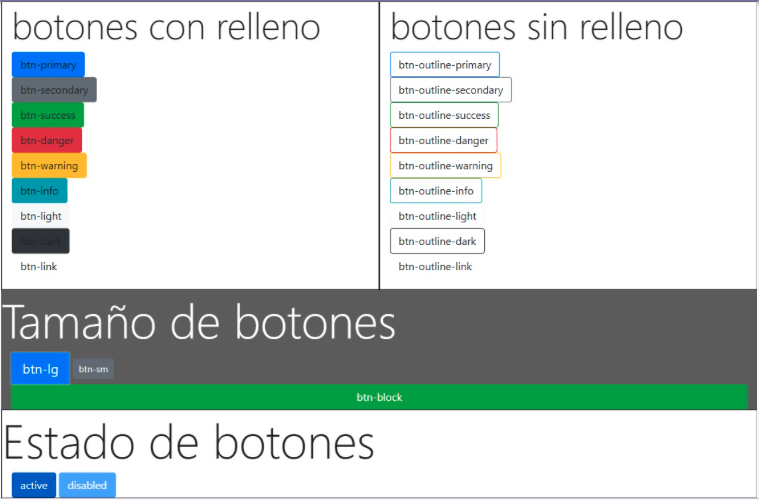
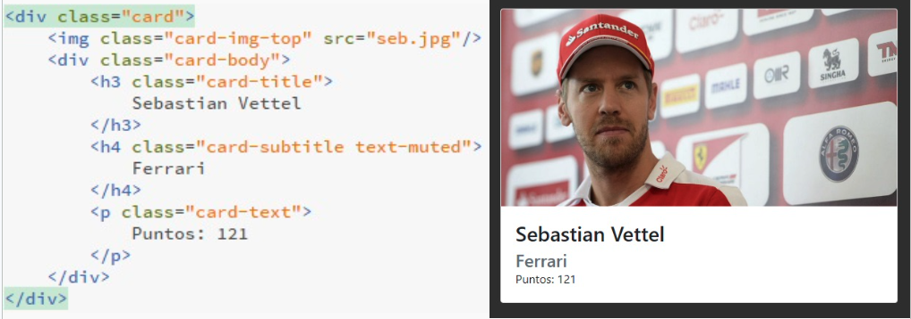
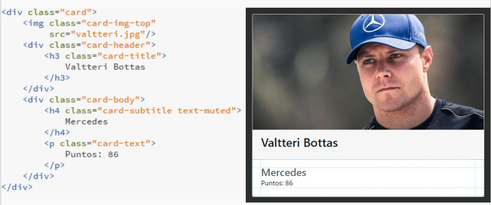
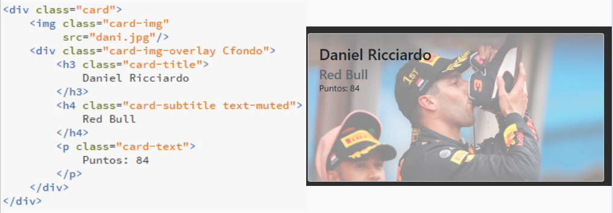

# Bootstrap

* Es un framework creado por Twitter para realizar interfaces web adaptables (responsive web design) a cualquier dispositivo, ya sea una tablet, un teléfono o una PC.
* La interfaz se adapta a cualquier tamaño y resolución de pantalla sin la intervención del usuario.
* En Chrome, activando CTRL+SHIFT+M se invoca el visor responsivo (se puede ver cómo se comporta una misma web, emulando en las plataforma móviles).
* Para hacer una plataforma totalmente compatible con los navegadores web más populares, el equipo de desarrollo de bootstrap armó la lógica de las clases que conforman su interfaz, utilizando hojas de estilo CSS y JavaScript.
* De esta manera, se garantiza que los navegadores web se comporten de la forma más estable posible cuando deben cargar un sitio web creado con este framework.

## Integración al proyecto

* Instalandola desde NodeJS
* Instalándola desde Browser
* **Descargando y referenciando los archivos localmente**
* Referenciando el framework a través de un CDN válido

```html
<head>
  <title>Probando Bootstrap</title>
  <link rel="stylesheet" type="text/css" href="bootstrap.min.css">
  <link rel="stylesheet" type="text/css" href="bootstrap-theme.min.css">
  <script src="bootstrap.min.js"></script>
  <meta name="viewport" content=""width=device-width, initial-scale=1>
</head>
```

## Clases

* Los estilos de bootstrap están definido por clases que nos permiten aplicar diseño rápido a los elementos que creamos en html.
* Simplemente, buscamos en bootstrap el estilo que deseamos aplicar y le damos esa clase a nuestro elemento de css.
* Recordemos que un elemento puede tener más de una clase.

## Contenedores

* **Responsive Container**:
  * Contenedor por default de bootstrap.
  * Está automáticamente centrado en el espacio que tenga disponible.
  * Ancho predefinido.

  ```html
  <div class=”container”> </div>
  ```

* **Fluid Container**:
  * No está centrado en el espacio disponible.
  * No tiene márgenes predefinidos.
  * Ancho 100%

  ```html
  <div class=”container-fluid”> </div>
  ```

## Párrafos

```html
<p>Párrafo común</p> 
<p class="lead">Párrafo con lead</p> 
<p class="text-center">Texto alineado en el centro</p> 
<p class="text-uppercase">Texto en mayúsculas</p>
```

## Alertas

```html
<div class="alert alert-success">Mensaje verde</div> 
<div class="alert alert-info">Mensaje azul</div> 
<div class="alert alert-warning">Mensaje amarillo</div> 
<div class="alert alert-danger">Mensaje rojo</div>
```

## Badges

```html
<span class="badge badge-primary">Primary</span> 
<span class="badge badge-secondary">Secondary</span> 
<span class="badge badge-success">Success</span> 
<span class="badge badge-danger">Danger</span> 
<span class="badge badge-warning">Warning</span> 
<span class="badge badge-info">Info</span> 
<span class="badge badge-light">Light</span> 
<span class="badge badge-dark">Dark</span>
```

```html
<button type="button" class="btn btn-primary">Bandeja de entrada <span class="badge badge-light">4</span></button> 
</br> 
<button type="button" class="btn btn-primary">Profile <span class="badge badge-light">9</span><span class="sr-only">unread messages</span></button> 
</br>
```

## Botones con significado

```html
<button class="btn btn-default">Botón común.</button> 
<button class="btn btn-warning">Botón de Advertencia.</button> 
<button class="btn btn-danger">Botón de Peligro.</button>
<button class="btn btn-default"><span class="glyphicon-plus"></span></button>
```



## Tarjetas (cards)

* Para definirlas tendremos que implementar un conjunto de divs con clases particulares que indiquen la utilidad de los mismos, además de los elementos que queramos incluir.
* Clases:

| Class | Descripción |
| -- | -- |
| class="card" | clase principal, define todo el recuadro de la tarjeta. No tiene ancho fijo, ocupa todo el espacio disponible |
| class="card-body" | contenedor en el que se encuentra el contenido principal de nuestra tarjeta |
| class="card-header" | contenedor de encabezado de la tarjeta |
| class="card-footer" | contenedor de pie de la tarjeta |
| class="card-img" | se aplica sobre un elemento de imagen. Define una imagen dentro de la tarjeta. También se puede utilizar "card-img-top" o "card-img-bottom" |
| class="card-text" | se aplica sobre texto para el contenido de la tarjeta |
| class="card-title" | se aplica sobre el título de la tarjeta |
| class="card-subtitle" | subtitulo de la tarjeta |
| class="card-img-overlay" | se aplica a un div para poner texto sobre imagen |








## Tablas

```html
<div class="table-responsive"> 
  <table class="table table-hover table-striped table-condensed table-bordered">
    <tr>
      <th>Nombre</th> 
      <th>Apellido</th> 
      <th>Email</th>
    </tr> 
    <tr> 
      <td>Pablo</td> 
      <td>Pandolfo</td> 
      <td>ppandomail@gmail.com</td>
    </tr> 
  </table> 
</div>
```

## Pestañas de navegación

```html
<ul class="nav nav-tabs"> 
  <li class="nav-item"> <a class="nav-link active" href="#">Noticias</a> </li> 
  <li class="nav-item"> <a class="nav-link" href="#">Publicaciones</a> </li> 
  <li class="nav-item"> <a class="nav-link" href="#">Trucos</a> </li> 
  <li class="nav-item"> <a class="nav-link" href="#">Mobile</a> </li> 
  <li class="nav-item"> <a class="nav-link disabled" href="#">Video reviews</a> </li> 
</ul>
```

## Paginación

```html
<nav aria-label="Page navigation example"> 
  <ul class="pagination"> 
    <li class="page-item"> <a class="page-link" href="#" aria-label="Previous"> <span aria-hidden="true">&laquo;</span> <span class="sr-only">Previous</span> </a> </li> 
    <li class="page-item"><a class="page-link" href="#">1</a></li> 
    <li class="page-item"><a class="page-link" href="#">2</a></li> 
    <li class="page-item"><a class="page-link" href="#">3</a></li> 
    <li class="page-item"><a class="page-link" href="#">...</a></li> 
    <li class="page-item"><a class="page-link" href="#" aria-label="Next"> <span aria-hidden="true">&raquo;</span> <span class="sr-only">Next</span> </a> </li> 
  </ul> 
</nav>
```

## Migas de pan

```html
<nav aria-label="breadcrumb"> 
  <ol class="breadcrumb"> 
    <li class="breadcrumb-item"><a href="#">Home</a></li> 
    <li class="breadcrumb-item"><a href="#">Trabajo</a></li> 
    <li class="breadcrumb-item active" aria-current="page">Contacto</li> 
  </ol> 
</nav>
```

## Barras de Progreso

```html
<div class="progress"> 
  <div class="progress-bar" role="progressbar" aria-valuenow="60" aria-valuemin="0" aria-valuemax="100" style="width: 60%;"> 
    <span class="sr-only">60% completado</span> 
  </div> 
</div> 
```

## Listas

```html
<ul class="list-group"> 
  <li class="list-group-item list-group-item-info">Argentina</li> 
  <li class="list-group-item list-group-item-success">Brasil</li> 
  <li class="list-group-item list-group-item-warning">Chile</li> 
  <li class="list-group-item list-group-item-danger">Ecuador</li> 
</ul>
```

## Ejercicios

1. Crear 8 tarjetas y agregar una de las siguientes clases al contenedor principal de cada tarjeta:
    * bg-primary
    * bg-secondary
    * bg-success
    * bg-danger
    * bg-warning
    * bg-info
    * bg-light
    * bg-dark
