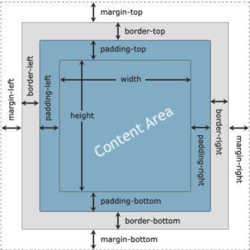

# CSS3

* CSS: Cascading Style Sheets (Hojas de Estilo en Cascada)
* Nació en 1996.
* La función del CSS es gestionar la apariencia (estilos) del sitio web (trazado, posicionamiento, diseño, color, tamaño del texto, etc.)
* Lenguaje de texto orientado al diseño gráfico que describe el estilo de un documento HTML, es decir, como deben mostrarse los elementos HTML.
* Es el código que se ocupa de dar vida gráfica al contenido por el cual navegamos.
* Con una hoja de estilo CSS vinculada al documento HTML, se cambia significativamente la forma de visualizar el contenido web.

* HTML (con CSS y sin CSS)


* El HTML define el contenido.
* El CSS se usa para colocar el contenido y definir la presentación: el color, la imagen de fondo, los márgenes, el tamño del texto, etc.
* CSS necesita una página HTML para funcionar.

## Incorporación de CSS en un documento HTML. Técnicas

### Incorporación en línea

* Utiliza un atributo global llamado **style** para insertar los estilos directamente en el elemento. Este atributo está disponible en cada uno de los elementos HTML y puede recibir una propiedad o una lista de propiedades que se aplicarán al elemento al que pertenece.

```html
<div style="margin:10px;"></div>
<p style="font-size: 20px;">Mi Texto</p>
```

* Los estilos en línea son una manera práctica de probar estilos y ver cómo modifican los elementos, pero no se recomiendan para proyectos extensos.
* Tienen la máxima prioridad y anulará los estilos externos e internos y los valores predeterminados del navegador.
* La razón es que el atributo style solo afecta al elemento en el que se ha declarado. Si queremos asignar el mismo estilo a otros elementos, tenemos que repetir el código en cada uno de ellos, lo cual incrementa innecesariamente el tamaño del documento, complicando su actualización y mantenimiento.

### Incorporación interna

* Uso de selectores que determinan los elementos que se verán afectados. Para este propósito, HTML incluye el elemento \<style>.

```html
<!DOCTYPE html>
<html lang="es">
  <head>  
    <style type="text/css">h1 {color:#000;} </style>
  </head>
  <body>
    <h1>Hola</h1>
  </body>
</html>
```

* Declarar estilos en la cabecera del documento ahorra espacio y hace que el código sea más coherente y fácil de mantener, pero requiere que copiemos las mismas reglas en cada uno de los documentos de nuestro sitio web.

### Incorporación externa

* Archivos de texto llamados "hojas de estilo" con la lista de reglas CSS que queremos asignar a los elementos del documento.
* El elemento \<link> se usa para incorporar recursos externos al documento.
* Dependiendo del tipo de recurso que queremos cargar, tenemos que declarar diferentes atributos y valores. Para cargar hojas de estilo CSS, solo necesitamos los atributos **rel** y **href**.
  * El atributo **rel** significa relación y especifica la relación entre el documento y el archivo que estamos incorporando, por lo que debemos declararlo con el valor stylesheet para comunicarle al navegador que el recurso es un archivo CSS con los estilos requeridos para presentar la página.
  * Por otro lado, el atributo **href** declara la URL del archivo a cargar.

```html
<head>
  <link rel="stylesheet" href="misestilos.css">
</head>
```

* El documento del ejemplo carga los estilos CSS desde el archivo misestilos.css.
* En este archivo tenemos que declarar las reglas CSS que queremos aplicar al documento, tal como lo hemos hecho anteriormente dentro del elemento \<style>.
* El siguiente es el código que debemos insertar en el archivo misestilos.css para producir el mismo efecto logrado en ejemplos anteriores.

```css
p {
  font-size: 20px;
}
```

* Otro ejemplo:

```css
body {
  background-color: chocolate;
}

h1 {
  background-color: black;
  font-family: Verdana, Arial;
  font-size: 3;
  color: yellow;
}
```

* La práctica de incluir estilos CSS en un archivo aparte es ampliamente utilizada por programadores se recomienda para sitios web diseñados con HTML5, no solo porque podemos definir una sola hoja de estilo y luego incluirla en todos los documentos con el elemento \<link>, sino porque podemos reemplazar todos los estilos a la vez simplemente cargando un archivo diferente, lo cual nos permite probar diferentes diseños y adaptar el sitio web a las pantallas de todos los dispositivos disponibles.

## Sintaxis

* En CSS, los estilos se declaran con propiedades.
* Un estilo se define declarando el nombre de la propiedad y su valor separado por dos puntos.

```css
font-size: 24px;
```

* Si la propiedad del ejemplo se aplica a un elemento, el texto contenido por ese elemento se mostrará en la pantalla con el tipo de letra definido por defecto, pero con un tamaño de 24 píxeles.
* La mayoría de las propiedades CSS pueden modificar un solo aspecto del elemento (el tamaño de la letra en este caso). Si queremos cambiar varios estilos al mismo tiempo, tenemos que declarar múltiples propiedades. CSS define una sintaxis que simplifica el proceso de asignar múltiples propiedades a un elemento. La construcción se llama **regla**.
* Una regla es una lista de propiedades declaradas entre llaves e identificadas por un selector.
* El selector indica qué elementos se verán afectados por las propiedades. Por ejemplo, la siguiente regla:

```css
p {
  color: #FF0000;
  font-size: 24px;
  text-align: center;
}
```

* La regla del ejemplo incluye dos propiedades con sus respectivos valores agrupadas por llaves (color y font-size). Si aplicamos esta regla a nuestro documento, el texto dentro de cada elemento \<p> se mostrará en color rojo y con un tamaño de 24 píxeles.

## Selectores

* Los elementos en los CSS, hacen referencia directa al html en la página a través de:

### Nombre del elemento

* Una regla declarada con el nombre del elemento como selector afecta a todos los elementos de ese tipo encontrados en el documento.
* Ejemplo: usamos el nombre **div** para modificar elementos \<div>

    ```css
    div {
      background-color: red;
      font-size: 14px;
    }
    ```

* Si queremos asignar los mismos estilos a elementos con nombres diferentes, podemos declarar los nombres separados por una coma. En el siguiente ejemplo, la regla afecta a todos los elementos \<p> y \<span> encontrados en el documento.

```css
p, span {
  font-size: 20px;
}
```

### Atributo Id

* Para seleccionar un elemento HTML sin considerar su tipo, podemos usar el atributo id. Este atributo es un nombre, un identificador exclusivo del elemento y, por lo tanto, lo podemos usar para encontrar un elemento en particular dentro del documento. Para referenciar un elemento usando su atributo id, el selector debe incluir el valor del atributo precedido por el carácter numeral (#).

  ```css
  #mitexto {
    font-size: 20px;
  }
  ```

* La regla del ejemplo solo se aplica al elemento identificado por el atributo id y el valor "mitexto", como el elemento \<p> incluido en el siguiente documento.

  ```html
  <!DOCTYPE html>
  <html lang="es">
    <head>
      <title>Este texto es el título del documento</title>
      <meta charset="utf-8">
      <link rel="stylesheet" href="misestilos.css">
    </head>
    <body>
      <main>
        <section>
          <p>Frase 1</p>
          <p id="mitexto">Frase 2</p>
          <p>Frase 3</p>
        </section>
      </main>
    </body>
  </html>

### Atributo Class

* En lugar de usar el atributo id para asignar estilos, en la mayoría de las ocasiones es mejor hacerlo con el atributo class. Este atributo es más flexible y se puede asignar a varios elementos dentro del mismo documento.

  ```css
  .mitexto {
    font-size: 20px;
  }
  ```

* Para referenciar un elemento usando su atributo class, el selector debe incluir el valor del atributo precedido por un punto. Por ejemplo, la regla del ejemplo afecta a todos los elementos que contienen un atributo class con el valor "mitexto", como en el siguiente ejemplo.

 ```html
  <!DOCTYPE html>
  <html lang="es">
    <head>
      <title>Este texto es el título del documento</title>
      <meta charset="utf-8">
      <link rel="stylesheet" href="misestilos.css">
    </head>
    <body>
      <main>
        <section>
          <p class="mitexto">Frase 1</p>
          <p class="mitexto">Frase 2</p>
          <p>Frase 3</p>
          <p>Frase 4</p>
        </section>
      </main>
    </body>
  </html>
```

### Atributos/valores

  ```css
  input [type=“text”] {
    text-align: center;
    height: 20px;
    width: 20px;
    border-radius: 5px;
  }
  ```

### Evento o pseudo-clase

  ```css
  input:valid {...}
  input:invalid {...}
  input[type="email"]:invalid {...}
  input:checked {...}
  input[name*="dato"]:checked {...}
  input:focus {...}

  a:hover {...}
  a:active {...}
  ```

### Jerárquicamente

* Podemos referenciar solo elementos que se encuentran dentro de un elemento en particular listando los selectores separados por un espacio. Estos tipos de selectores se llaman selectores de descendencia porque afectan a elementos dentro de otros elementos, sin importar el lugar que ocupan en la jerarquía.

  ```css
  div p {...}              /* todos los p hijos de div */
  div#container > p {...}  /* todos los hijos que tengan como padre directo a div */ 
  div + p {...}            /* el primer hermano p del div */
  div ~ p {...}            /* todos los p cuyo hermano anterior es un div */
  ```

### Avanzados

  ```css
  div p:first-child {...}    /* si hubiese un div  y dentro se encontrase un párrafo que fuese a su vez el primer hijo de este se vería afectado */
  p:first-of-type {...}      /* si diese el caso que hay un párrafo y fuese el primero de su tipo se vería afectado */
  div p:last-of-type {...}   /* último de su tipo debe ser un párrafo y encontrarse en un div */
  li:nth-child(3) {...}      /* debe ser un li y ser el 3er. hijo de su padre */
  li:nth-last-child(3) {...} /* debe ser un li y ser el 3er. hijo de su padre contando desde el último hijo, es decir, de abajo hacia arriba */
  li:nth-of-type(3) {...}     /* debe ser contando desde arriba, el 3er. de su tipo */
  li:nth-last-of-type(3) {... /* debe ser contando desde abajo el 3er. de su tipo */
  ```
  
### Múltiple (agrupación de selectores)

  ```css
  h1, h2, p {
    text-align: right;
    color: grey;
  }
  ul li ul > li {
    display: inline-block;
  }
  table tr.mi-clase > div {
    color: blue;
  }
  ```

## Popiedades

* Son la pieza central de CSS.
* Todos los estilos que podemos aplicar a un elemento se definen por medio de propiedades.
* CSS3 Generator: [CSS3 Generator](css3generator.com)
* Para simplificar su estudio, se pueden clasificar en dos tipos:
  * **Propiedades de formato**: se encargan de dar forma a los elementos y su contenido.
  * **Propiedades de diseño**: están enfocadas a determinar el tamaño y la posición de los elementos en la pantalla.

### Propiedades de formato

#### Texto

| Propiedad | Uso |
| -- | -- |
| **font-family** | Declara el tipo de letra que se usa para mostrar el texto. Se pueden declarar múltiples valores separados por coma para ofrecer al navegador varias alternativas en caso de que algunos tipos de letra no se encuentren disponibles en la computadora del usuario. Algunos de los valores estándar son Georgia, "Times New Roman", Arial, Helvetica, "Arial Black", Gadget, Tahoma, Geneva, Verdana, Impact, y sans-serif (los nombres compuestos por más de una palabra se deben declarar entre comillas dobles) |
| **font-size** | Determina el tamaño de la letra. El valor puede ser declarado en píxeles (px), porcentaje (%), o usando cualquiera de las unidades disponibles en CSS como em, rem, pt, etc. El valor por defecto es normalmente 16px |
| **font-weight** | Determina si el texto se mostrará en negrita o no. Los valores disponibles son normal y bold, pero también podemos asignar los valores 100, 200, 300, 400, 500, 600, 700, 800, y 900 para determinar el grosor de la letra (solo disponibles para algunos tipos de letra) |
| **font-style** | Determina el estilo de la letra. Los valores disponibles son normal, italic, y oblique |
| **font**| Permite declarar múltiples valores al mismo tiempo. Los valores deben declararse separados por un espacio y en un orden preciso. El estilo y el grosor se deben declarar antes que el tamaño, y el tipo de letra al final (por ejemplo, font: bold 24px Arial, sans-serif) |

#### Otros aspectos del texto

| Propiedad | Uso |
| -- | -- |
| **text-align** | Alinea el texto dentro de un elemento. Los valores disponibles son left, right, center, y justify |
| **text-align-last** | Alinea la última línea de un párrafo. Los valores disponibles son left, right, center, y justify |
| **text-indent** | Define el tamaño de la sangría de un párrafo (el espacio vacío al comienzo de la línea). El valor se puede declarar en píxeles (px), porcentaje (%), o usando cualquiera de las unidades disponibles en CSS, como em, rem, pt, etc. |
| **letter-spacing** | Define el espacio entre letras. El valor se debe declarar en píxeles (px), porcentaje (%) o usando cualquiera de las unidades disponibles en CSS, como em, rem, pt, etc. |
| **word-spacing** | Define el ancho del espacio entre palabras. El valor puede ser declarado en píxeles (px), porcentaje (%) o usando cualquiera de las unidades disponibles en CSS, como em, rem, pt, etc. |
| **line-height** | Define el espacio entre líneas. El valor se puede declarar en píxeles (px), porcentaje (%) o usando cualquiera de las unidades disponibles en CSS, como em, rem, pt, etc. |
| **vertical-align** | Alinea elementos verticalmente. Se usa frecuentemente para alinear texto con imágenes (la propiedad se aplica a la imagen). Los valores disponibles son baseline, sub, super, text-top, text-bottom, middle, top, y bottom |
| **text-decoration** | Los valores disponibles son overline, line-through, underline, none |
| **text-transformation** | Los valores disponibles son capitalize, lowercase, uppercase |
| **text-shadow** | Sombrea el texto. Orden: h-shadow, v-shadow, color. Ejemplo: text-shadow: 2px 3px #FE990F; |
| **overflow** | Especifica cómo se mostrará el contenido que desborda el elemento. Los valores disponibles son visible (por defecto), hidden (esconde el contenido que no entra dentro de la caja), scroll (muestra barras laterales para desplazar el contenido), auto (deja que el navegador decida qué hacer con el contenido). |

#### Colores

| Propiedad | Uso |
| -- | -- |
| **rgb (rojo, verde, azul)** | Esta función define un color por medio de los valores especificados por los atributos (desde 0 a 255). Por ejemplo, rgb(153, 102, 51) |
| **rgba (rojo, verde, azul, alfa)** | Esta función es similar a la función rgb(), pero incluye un componente adicional para definir la opacidad (alfa). El valor se puede declarar entre 0 y 1, con 0 como totalmente transparente y 1 como totalmente opaco |
| **hsl (matiz, saturación, luminosidad)** | Esta función define un color desde los valores especificados por los atributos. Los valores se declaran en nú- meros decimales y porcentajes |
| **hsla (matiz, saturación, luminosidad, alfa)** | Esta función es similar a la función hsl(), pero incluye un componente adicional para definir la opacidad (alfa). El valor se puede declarar entre 0 y 1, con 0 como totalmente transparente y 1 como totalmente opaco |
| **color** | Declara el color del contenido del elemento |

```css
#titulo {
  font: bold 26px Verdana, sans-serif;
  color: #CCCCCC;
}
```

#### Tamaño

* Por defecto, el tamaño de la mayoría de los elementos se determina según el espacio disponible en el contenedor. El ancho de un elemento se define como 100 %, lo cual significa que será tan ancho como su contenedor, y tendrá una altura determinada por su contenido.

| Propiedad | Uso |
| -- | -- |
| **width** | Declara el ancho de un elemento. El valor se puede especificar en píxeles, porcentaje, o con la palabra clave auto (por defecto) |
| **height** | Declara la altura de un elemento. El valor se puede especificar en píxeles, porcentaje, o con la palabra clave auto (por defecto) |

```css
#titulo {
  font: bold 26px Verdana, sans-serif;
}
#descripcion {
  width: 200px;
  height: 100px:
}
```

#### Mínimo y máximo

* Podés especificar las dimensiones máximas y mínimas de un bloque. Esto es muy útil ya que nos permite definir dimensiones "límite" para permitirle a nuestra página adaptarse a las diferentes resoluciones de las pantallas de los visitantes.

| Propiedad | Uso |
| -- | -- |
| **min-width** | anchura mínima |
| **min-height** | altura mínima |
| **max-width** | anchura máxima |
| **max-height** | altura máxima |

* Por ejemplo, podés especificar que los párrafos deben ocupar en 50% del ancho y tener al menos 400 píxeles de ancho en todos los casos.

```css
p {
  width: 50%;
  min-width: 400px;
}
```

* Ve el resultado cambiando la anchura de la ventana de tu navegador. Verás que, si es muy pequeño, el párrafo se ve forzado a tener una anchura de al menos 400 píxeles.

## Modelo de Caja

* Una página web puede ser vista como una sucesión y un conjunto de cajas llamadas **bloques**. La mayoría de los elementos vistos son bloques: \<header>, \<article>, \<nav> ... Pero existen otros bloques: párrafos \<p>, títulos \<h1>, etc.
* En HTML, la mayoría de las etiquetas pueden colocarse en una o dos categorías:
  * **etiquetas inline**: este es el caso, por ejemplo, de los enlaces \<a></a>, \<em>, \<strong>, \<mark>, \, etc.
  * **etiquetas de bloque**: este es el caso, por ejemplo, de los párrafos \<p>, \<footer>, \<h1>, \<article>, etc.
* En realidad, hay varias categorías muy específicas, como las celdas de las tablas (table- cell) o viñetas (list-item).

* En content, el tamaño del objeto no se ve afectado por la definición de márgenes, padding o border.



## Márgenes

* Hay dos tipos de márgenes:
  * márgenes exteriores (margin)
  * márgenes interiores (padding)
  
### Márgenes exteriores (margin)

* Utilizada para crear espacio alrededor de los diferentes elementos que integran una página web.
* Esta propiedad declara el margen de un elemento.
* El margen es el espacio que hay alrededor de la caja.
* Puede recibir cuatro valores que representan el margen superior, derecho, inferior, e izquierdo, en ese orden y separados por un espacio (por ejemplo, margin: 10px 30px 10px 30px;). * Sin embargo, si solo se declaran uno, dos o tres valores, los otros toman los mismos valores (por ejemplo, margin: 10px 30px asigna 10 píxeles al margen superior e inferior y 30 píxeles al margen izquierdo y derecho).
* Los valores se pueden declarar independientemente usando las propiedades asociadas margin-top, margin-right, margin-bottom y margin-left (por ejemplo, margin-left: 10px;).
* La propiedad también acepta el valor auto para obligar al navegador a calcular el margen (usado para centrar un elemento dentro de su contenedor).
* Ejemplo:

```css
p {
  border-style: solid;
  border-color: aqua;
  font-family: cursive;
  color: red;
  margin-left: 50px;
}
```

* Simplificado:

```css
p {
  margin: 20px 40px 60px 80px; /* top, right, bottom, left */
}
```

```css
p {
  margin: 20px 40px; /* top y bottom, right y left */
}
```

```css
p {
  margin: 20px; /* top y right y left y bottom */
}
```

### Márgenes interiores (padding)

* Utilizada para generar espacio alrededor del contenido de un elemento, limpiando el área entre el borde y su contenido propio del elemento.
* Esta propiedad declara el relleno de un elemento.
* El relleno es el espacio entre el contenido del elemento y los límites de su caja.
* Los valores se declaran de la misma forma que lo hacemos para la propiedad margin, aunque también se pueden declarar de forma independiente con las propiedades padding-top, padding-right, padding-bottom y padding-left (por ejemplo, padding-top: 10px;).
* Ejemplo:

```css
p {
  border-style: solid;
  border-color: aqua;
  font-family: cursive;
  color: red;
  padding-top: 40px;
}
```

* Simplificado:

```css
p {
  padding: 20px 40px 60px 80px; /* top, right, bottom, left */
}
```

```css
p {
  padding: 20px 40px; /* top y bottom, right y left */
}
```

```css
p {
  padding: 20px; /* top y right y left y bottom */
}
```

### Centrar bloques

* Los bloques pueden centrarse perfectamente.
* Y un diseño centrado es cómodo cuando no tienes la resolución del visitante.

```css
p {
  width: 350px; /* Especificamos una anchura (obligatorio) */
  margin: auto; /* Podemos pedir que el bloque se centre con el auto */ 
  border: 1px solid black;
  text-align: justify;
  padding: 12px;
  margin-bottom: 20px;
}
```

## Fondo

* Los elementos pueden incluir un fondo que se muestra detrás del contenido del elemento y a través del área ocupada por el contenido y el relleno.

| Propiedad | Uso |
| -- | -- |
| **background-color** | Asigna un fondo de color a un elemento |
| **background-image** | Asigna una o varias imágenes al fondo de un elemento. La URL del archivo se declara con la función url() (por ejemplo, url(“ladrillos.jpg”)). Si se requiere más de una imagen, los valores se deben separar por una coma |
| **background-position** | Declara la posición de comienzo de una imagen de fondo. Los valores se pueden especificar en porcentaje, píxeles o usando una combinación de las palabras clave center, left, right, top, y bottom |
| **background-size** | Declara el tamaño de la imagen de fondo. Los valores se pueden especificar en porcentaje, píxeles, o usando las palabras clave cover y contain. La palabra clave cover expande la imagen hasta que su ancho o su altura cubren el área del elemento, mientras que contain estira la imagen para ocupar toda el área del elemento |

### Fondo gradiente

* **linear-gradient**: permite especificar un fondo con un degradado de colores lineales, ya sea vertical, horizontal o diagonal.

  ```css
  #lineal {
    background: linear-gradient(to bottom right, blue, lightblue);
  }
  ```

* **radial-gradient**: permite establecer un radio determinado, definido por supuesto desde su centro.

  ```css
  #radial {
    background: radial-gradient(darkblue, blue, lightblue 70%);
  }
  ```

## Border

* Los elementos pueden incluir un borde en los límites de la caja del elemento.
* Por defecto, los navegadores no muestran ningún borde, pero podemos usar las siguientes propiedades para definirlo.

| Propiedad | Uso |
| -- | -- |
| **border-width** | Define el ancho del borde. Acepta hasta cuatro valores separados por un espacio para especificar el ancho de cada lado del borde (superior, derecho, inferior, e izquierdo, es ese orden). También podemos declarar el ancho para cada lado de forma independiente con las propiedades border-top-width, border-bottom-width, border-left-width y border-right-width |
| **border-style** | Define el estilo del borde. Acepta hasta cuatro valores separados por un espacio para especificar los estilos de cada lado del borde (superior, derecho, inferior, e izquierdo, en ese orden). Los valores disponibles son none, hidden, dotted, dashed, solid, double, groove, ridge, inset, y outset. El valor por defecto es none, lo que significa que el borde no se mostrará a menos que asignemos un valor diferente a esta propiedad. También podemos declarar los estilos de forma independiente con las propiedades border-top-style, border-bottom-style, border-left-style, y border-right-style |
| **border-color** | Define el color del borde. Acepta hasta cuatro valores separados por un espacio para especificar el color de cada lado del borde (superior, derecho, inferior, e izquierdo, en ese orden). También podemos declarar los colores de forma independiente con las propiedades border-top-color, border-bottom-color, border-left-color, y border-right-color |
| **border-radius** | Define un borde redondeado |
| **border-collapse** | Para tablas, "pegar los bordes" |
| **border-separate** | Para tablas, los bordes se separarán (valor por defecto) |
| **border** | Permite declarar todos los atributos del borde al mismo tiempo. También podemos usar las propiedades border-top, border-bottom, border-left, y border-right para definir los valores de cada borde de forma independiente |

```css
h1 {
  border-width: medium;      /* Ancho de borde */
  border-style: solid;       /* Estilo de borde */
  border-color: aquamarine;  /* Color de borde */
  border-radius: 18px;       /* Redondeo de borde */
}
```

```css
border-radius: 30px;                /* mismo valor para los 4 extremos */
border-radius: 30px 30px;           /* top-left y bottom-right, top-right y bottom-left */
border-radius: 30px 30px 30px;      /* top-left, top-right, bottom-left */
border-radius: 30px 30px 30px 30px; /* top-left, top-right, bottom-right, bottom-left */
```

* Simplificado, solo es obligatorio el atributo de estilo

```css
h1 {
  border: groove aquamarine 18px;
}
```

## Hipervínculos

* Por defecto: estilo subrayado y color fuente azul, que se torna a violeta una vez accedido.
* CSS permite personalizar el estilo de cada hipervínculo para cada estado.
  * a:link -> hipervínculo normal, no visitado
  * a:visited -> hipervínculo que ya ha sido visitado por  el usuario
  * a:hover -> hipervínculo donde el cursor del dispositivo se encuentra encima o señalándole
  * a:active -> hipervínculo en el momento en el cual es cliqueado o activado. Sólo dura lo que dura el click

* Ejemplos:

```css
a:link {
  text-decoration: none;
  color: brown;
}

a:visited {
  text-decoration: none;
  color: hotpink;
}

a:hover {
  text-decoration: underline;
  color: darkblue;
}

a:active {
  text-decoration: none;
  color: darkslateblue;
}
```

* Se pueden modificar los hipervínculos para que simulen ser botones interactivos:

```css
a:link, a:visited {
  background-color: steelblue;
  color: snow;
  border: solid;
  padding: 14px 14px;
  text-align: center;
  text-decoration: none;
  display: inline-block;
}

a:hover, a:active {
  background-color: snow;
  color: steelblue;
  border: double;
  border-color: steelblue;
  padding: 14px 14px;
  text-align: center;
  text-decoration: none;
  display: inline-block;
}
```

## Listas

* CSS permite a través de diferentes propiedades mejorar el estilo de las listas HTML.
  * list-style-type -> permite especificar el estilo de viñeta en las listas desordenadas
  * list-style-image -> permite especificar una imagen que reemplaza a la viñeta
  * list-style-position -> especifica si los marcadores de elementos de lista deben aparecer dentro o fuera del contenido de la lista
  * list-style -> simplifica el uso de las otras 3 propiedades en el siguiente orden: list-style-type, list-style-position,     list-style-image

* Ejemplo:

```css
ul {
  background: #009999;
  padding: 24px;
}
ul li {
  list-style-image: url('ok.png');
  list-style-position: outside;
  margin: 8px;
  padding: 6px;
  background: #00B9B9;
  color: dimgray;
}
```

## Posicionamiento

* Los navegadores crean una caja virtual alrededor de cada elemento para determinar el área que ocupan.
* Para organizar estas cajas en la pantalla, los elementos se clasifican en dos tipos básicos:
  * Block (bloque)
  * Inline (en línea)
* La diferencia principal entre estos dos tipos es que los elementos Block tienen un tamaño personalizado y generan saltos de línea, mientras que los elementos Inline tienen un tamaño determinado por su contenido y no generan saltos de línea. Debido a sus características, los elementos Block se colocan de uno en uno en las distintas líneas, y los elementos Inline se colocan uno al lado del otro en la misma línea, a menos que no haya suficiente espacio horizontal disponible.
* Debido a sus características, los elementos Block son apropiados para crear columnas y secciones en una página web, mientras que los elementos Inline son adecuados para representar contenido.
* Esta es la razón por la que los elementos que definen la estructura de un documento, como \<section>, \<nav>, \<header>, \<footer>, o \<div>, se declaran como elementos Block por defecto, y otros como \<span>, \<strong>, o \<em>, que representan el contenido de esos elementos, se declaran como elementos Inline.

### Display

* El que un elemento sea del tipo Block o Inline lo determina el navegador, pero podemos cambiar esta condición desde CSS con la siguiente propiedad.

| Propiedad | Uso |
| -- | -- |
| **display** | Define el tipo de caja usado para presentar el elemento en pantalla. Existen varios valores disponibles para esta propiedad. Los más utilizados son none (elimina el elemento), block (muestra el elemento en una nueva línea y con un tamaño personalizado), inline (muestra el elemento en la misma línea), e inline-block (muestra el elemento en la misma línea y con un tamaño personalizado) |

```css
header, section, main, footer, aside, nav, article, figure, figcaption {
  display: block;
}
```

### Float

* El modelo de caja tradicional establece que los elementos pueden flotar a cada lado de la ventana y compartir espacio en la misma línea con otros elementos, sin importar su tipo.
* Por ejemplo, si tenemos dos elementos Block que representan columnas en el diseño, podemos posicionar una columna a la izquierda y la otra columna a la derecha haciendo que los elementos floten hacia el lado que queremos.

| Propiedad | Uso |
| -- | -- |
| **float** | Permite a un elemento flotar hacia un lado u otro, y ocupar el espacio disponible, incluso cuando tiene que compartir la línea con otro elemento. Los valores disponibles son none (el elemento no flota), left (el elemento flota hacia la izquierda) y right (el elemento flota hacia la derecha) |
| **clear** | Restaura el flujo normal del documento, y no per- mite que el elemento siga flotando hacia la izquierda, la derecha o am- bos lados. Los valores disponibles son none, left, right, y both (ambos) |

## Tranformaciones

* Permiten aplicar, sobre elementos HTML, diferentes efectos, cambiando el estado original de estos.
* Dentro de los efectos se puede aplicar:
  * translate(x, y) : mueve un elemento entre sus ejes x e y. También: translateX(n) o translateY(n).
  * scale(x, y) : cambia ancho y alto. También scaleX(n) o scaleY(n).
  * rotate(aº) : rota un elemento hacia un ángulo determinado [0º,360º] en el sentido de las agujas reloj o [0º,-360º] caso contrario.
  * skew(xº, yº) : Tuerce un elemento sobre los ejes X e Y. También skewX(nº) o skewY(nº)

* Ejemplo:

```css
div {
  width: 200px;
  height: 100px;
  background-color: yellow;
  transform: rotate(7deg);
}
```

## Transiciones

* Permiten cambiar de forma gradual los valores de las otras propiedades de animación, integrando una fusión de uno o más efectos con un tiempo de duración determinado.
* Se activan con el :hover y el :focus.

```css
img {
  opacity: 0.4;
  width: 200px;
  border: 2px solid lightgray;
  transition: all 0.3s ease-out;
}

/*
ease: Inicia despacio, sucede rápido y termina despacio
linear: Mantiene la transición con estilo de velocidad igual en toda la duración de la misma
ease-in: Inicia despacio, luego sucede normal y termina normal
ease-out: Inicia normal, sucede normal  y termina despacio
ease-in-out: Inicia despacio, sucede normal y termina despacio
*/

img:hover {
  opacity: 1;
  width: 220px;
  transform: rotate(-3deg);
}
```

## Animaciones

* Permiten que un elemento HTML cambie gradualmente de un estilo hacia otro.
* @keyframes:
  * Son los "fotogramas" en que la animación cambia.
  * Esta regla es la encargada de ejecutar los estilos CSS predefinidos.
  * Cada estilo definido dentro de esta se ejecutará, alternando el estilo original, dentro de una cantidad de tiempo. Este período está definido, a través de la propiedad animation-delay, en segundos.
  * Todos esos segundos se deben dividir en % dentro de la regla @keyframes, que le asigna un % determinado a cada uno de los estilos que se ejecutarán dentro de dicha animación (desde 0% hasta 100%)
* Ejemplo: escala de grises

```css
#anima {
  background: white;
  width: 400px;
  height: 400px;
  border: 1px solid lightgray;
}

#anima:hover {
  background: white;
  animation-name: ejemplo; /* nombre de la animación para poder identificarla y ejecutarla */
  animation-delay: 2s;     /* especifica cuántos segundos se retarda la animación, desde el momento que se activa su ejecución */
  animation-duration: 4s;  /* es el tiempo (en segundos), que durará la animación */
}

@keyframes ejemplo {
  0%   { background: lightgray; }
  20%  { background: dimgray; }
  40%  { background: darkslategray; }
  60%  { background: black; }
  80%  { background: dimgray; }
  100% { background: black; }
}
```

* Ejemplo: blinking background

```css
#demo {
  width: 300px;
  height: 300px;
  animation: blinking 1s infinite; /* name, delay, duration*/
}

@keyframes blinking {
  0%   { background-color: red; }
  50%  { background-color: blue; }
  100% { background: green; }
}
```

## Ejercicios

1. Diseñar un archivo de nombre index.html que tenga el contenido mínimo de un currículum vitae. Debe tener encabezado, cuerpo , en los que deben utilizar las etiquetas y atributos vistos, insertar imágenes en el background y en el contenido del body, ejem foto de perfil. Debe tener al menos un formulario diseñado.

1. Parte 1: Organizar la arquitectura de su web y realizado los siguientes archivos:
    * Index.html de página principal
    * Index.html de paginauno
    * Index.html de paginados

1. Parte 2: Agregar a la estructura de tu página web ya realizada, el siguiente código:
    * En la carpeta css, codificar un archivo con la extensión .css
    * Utilizar la sintaxis css estudiados en esta clase para hacer una web con estilo.
    * Hacer un enlace externo desde el index.html principal de tu web al archivo .css
