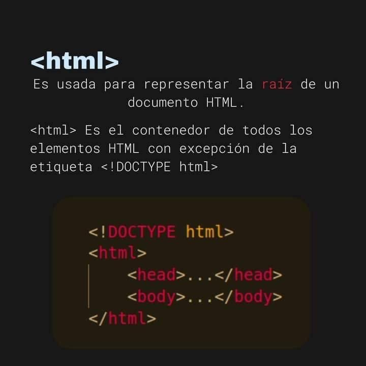
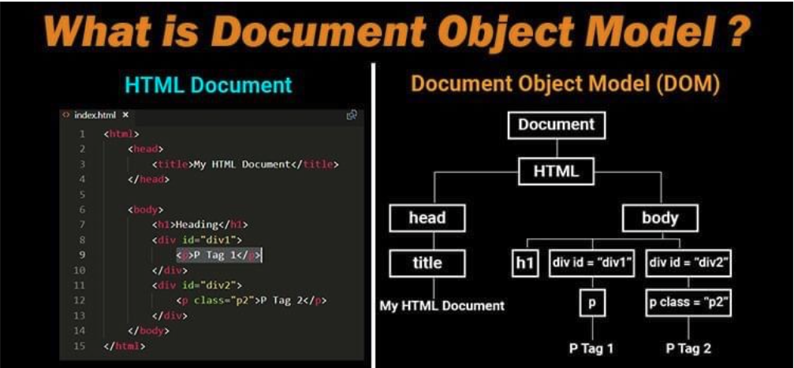
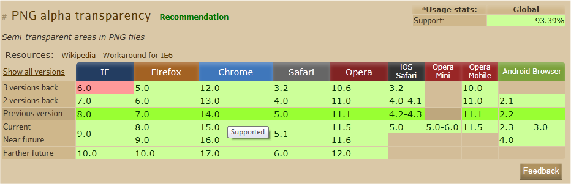
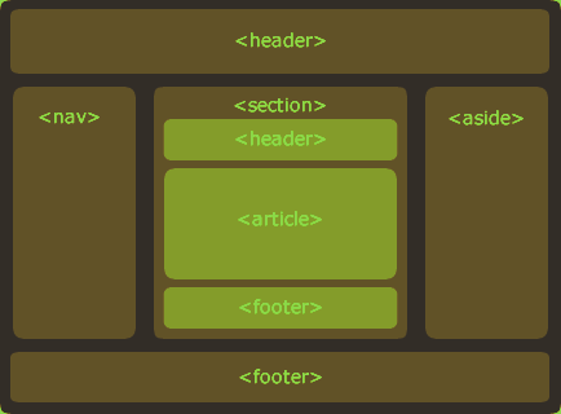
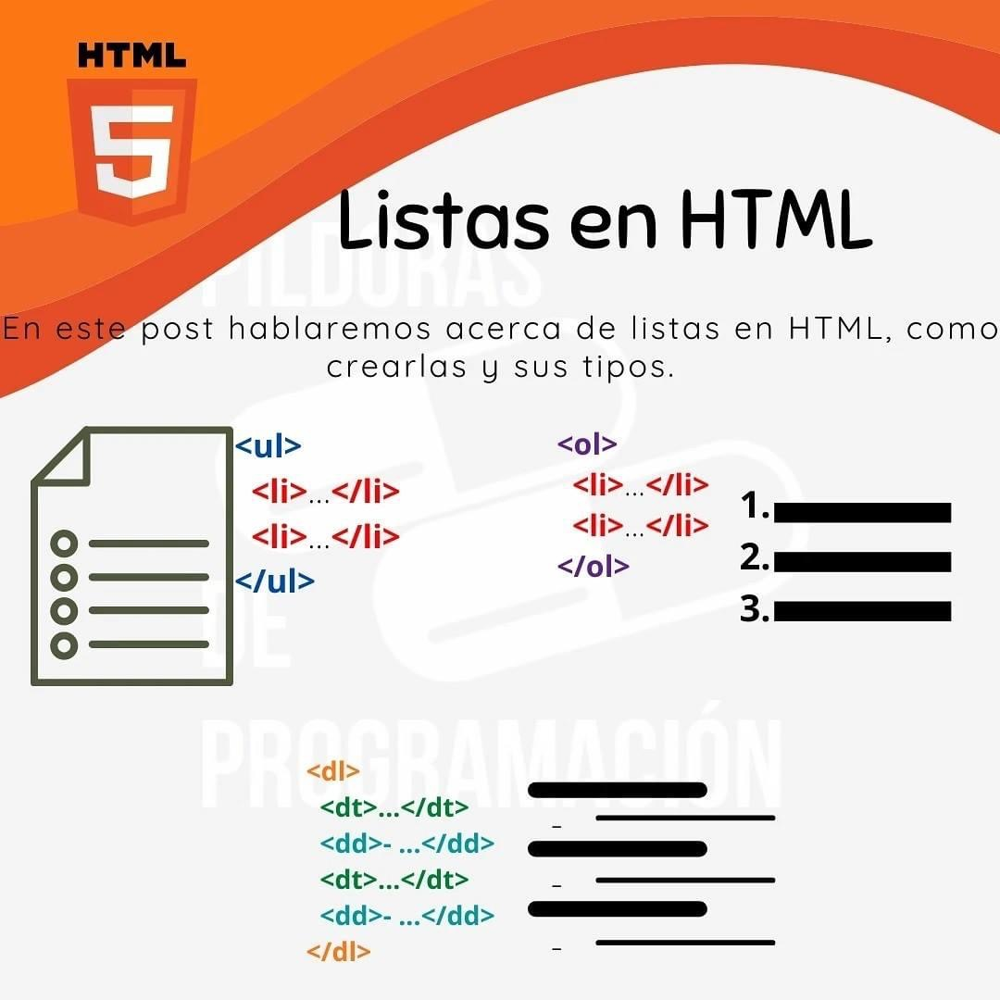
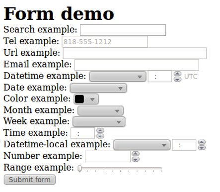
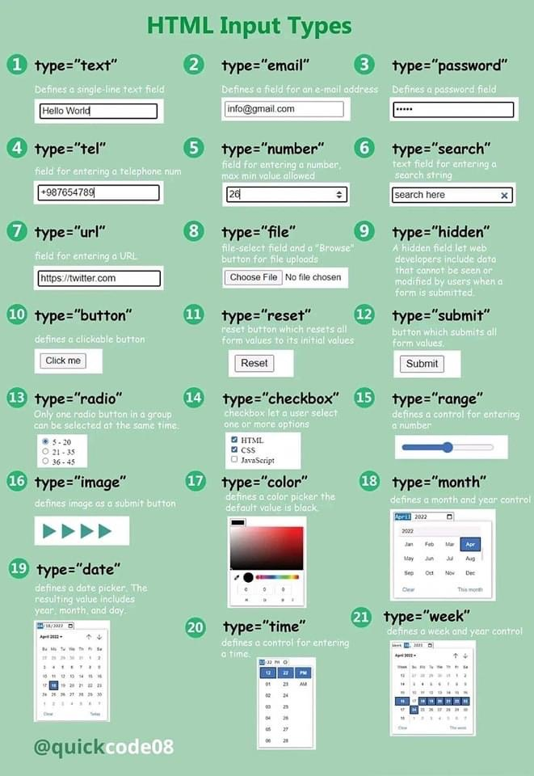
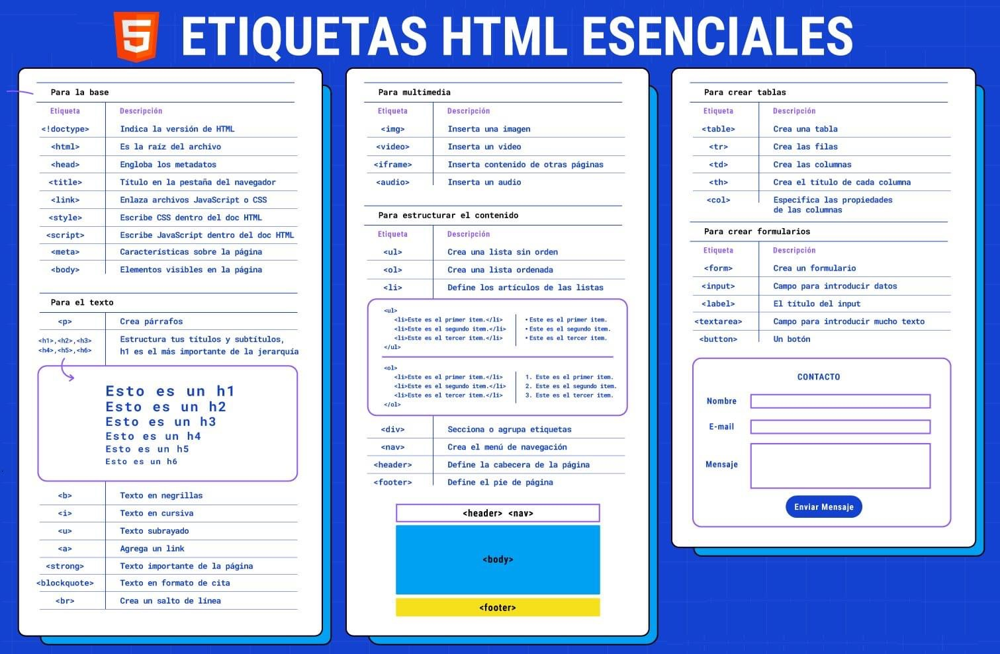

# HTML5

* HTML: HyperText Markup Language (Lenguaje de Marcas de Hiper Textos)
* Creado en 1989 por Tim Berners. La 1ra. página se publicó en 1991.
* Es el lenguaje básico utilizado para el desarrollo base o maquetación (dar la estructura y todo el sentido a los elementos) de una WEB.
* Su función es gestionar y organizar el contenido. Por lo tanto, usarás el HTML para escribir lo que quieras que muestre la página: texto, enlaces, imágenes, etc.
* Estandarizado por W3C (World Wide Web Consortium)
* Permite distinguir cada componente (títulos, imágenes, videos, audios, etc.) de una página web a través de la organización segmentada en tags.

## Estructurar tu página

* En general, una página web consiste de un encabezamiento (parte superior derecha), menús de navegación (en la parte superior o en los lados), varias secciones en el centro... y un pie de página (abajo a la derecha).

## Etiquetas

* HTML es un lenguaje basado en marcas, mejor conocidos como etiquetas (tags), las cuales marcan la estructura y el sentido de la página.
* Nos permitirán decir: "Este es mi encabezado", "este es mi menú de navegación", etc.
* < />
* La mayoría de etiquetas deben ser abiertas y cerradas posteriormente (exceptuando algunas que solo abren)
* Sintaxis: \<etiqueta atributo = valor> contenido \</etiqueta>

## Estructura básica de una página HTML5




      ```html
      <!DOCTYPE html>
      <html> 
        <head>
          <meta charset=”utf-8”/>
          <title>Título</title>
        </head>
        <body>
        </body>
      </html>
      ```

* Una página web se compone de dos partes:
  * **Cabecera \<head>**: esta sección proporciona información general sobre la página como su título, la codificación (para la gestión de caracteres especiales), documentos vinculados, etc. Esta sección suele ser bastante corta. La información que contiene la cabecera no se muestra en la página y es simplemente información general concebida para la computadora. ¡Sin embargo, es muy importante!
  * **Cuerpo \<body>**: es aquí donde se encuentra la parte principal de la página. Todo lo que tecleemos aquí se mostrará en la pantalla. La mayor parte de nuestro código se tecleará en el cuerpo.

## Atributos

* Cada una de las etiquetas contienen propiedades, la cuales toman la función de identificar o completar la información de esa etiqueta, a estas propiedades se le conoce como atributos.
* Tipos de atributos:
  * **Básicos**: Ejemplos: id, class, style, title, name, etc.
  * **De eventos**: Ejemplos: onclick, ondblclick, onmousedown, onfocus, etc.

## Funcionamiento

1. HTML+CSS+JS: Se ocupan de formatear todo el contenido web.
1. Luego es procesado por el motor de render de un navegador web.
1. Para ser visualizado de forma comprensible por los usuarios finales.

## DOM

* Document Object Model
* Es la estructura jerárquica de la estructura de nuestra web, representada en un diagrama.



## Compatibilidad



[Caniuse](caniuse.com)

## Etiquetas básicas

| Etiqueta | Uso | Ejemplo |
| -- | -- | -- |
| \<!DOCTYPE html> | Para definir el tipo de documento que está cargando el navegador | \<!DOCTYPE html> |
| \<html> | Etiqueta principal del código. Incluye el contenido completo de la página | \<html> ... \</html> |
| \<head> | Información para el navegador | \<head> ... \</head> |
| \<meta charset="utf-8" /> | Determina la forma en la que se van a mostrar los caracteres especiales (acentos, caracteres japones, etc.) | |
| \<meta name="description" content="descripción de mi página"/> | Define la descripción de la página | |
| \<meta name="keywords" content="ap2023, HTML, programación" /> | Define palabras claves | |
| \<meta name="author" content="nombre del autor" /> | Define autor de la página | |
| \<title> | Para el título de la Web, visible en la pestaña del navegador | \<title> Este es el título de mi página \</title> |
| \<link> | Para enlazar CSS y elementos externos | \<link> ... \</link> |
| \<style> | Para hojas de estilos | \<style\> h1 {color:red;}  p {color:blue;} \</style\> |
| \<script\> | Para enlazar interna o externamente un script de JavaScript | \<script type=“text/javascript”\> var mensaje = “Hola Mundo” \</script\> |
| \<body\> | Para contenido visible de la pág web | \<body\> ... \</body\> |
| \<h1>...\<h6> | Para encabezados (títulos) por jerarquía | \<h1> Este es el título principal \</h1> |
| \<p> | Representa el texto o párrafo que compone la página web | \<p> Esto es un párrafo \</p> |
| \<div> | Especifica una sección dentro de un documento para agrupar elementos | \<div> ... \</div> |
| \<span> | Para crear subdivisiones dentro de una capa (por ejemplo, div) | \<span style="color: green;">de\</span> |
| \<br> | Para insertar un salto de línea. No requiere un tag de cierre |  \<p>Hola \<br> Mundo \</p> |
| \<hr> | Para trazar una línea horizontal. No requiere un tag de cierre | \<p>Hola\</p> \<hr> \<p>Mundo\</p> |
| \<blockquote> | Para insertar una acotación o una cita dentro del párrafo | \<blockquote cite="http://..."> \<p>Hola Mundo\</p>\</blockquote> |

### Ejemplo títulos

    ```html
    <html>
      <head></head>
      <body>
        <h1>heading 1</h1>
        <h2>heading 2</h2>
        <h3>heading 3</h3>
        <h4>heading 4</h4>
        <h5>heading 5</h5>
        <h6>heading 6</h6>
      </body>
    </html>
    ```

### Ejemplo párrafos

    ```html
    <html>
      <head></head>
      <body>
        <p>Esto es un párrafo</p>
        <p>Esto es otro párrafo</p>
      </body>
    </html>
    ```

## Etiquetas estructurales HTML5

| Etiqueta | Uso | Ejemplo |
| -- | -- | -- |
| \<main> | Para representar el contenido principal del Body, elemento o sección | |
| \<header> | Para definir la cabecera de la Web, elemento o sección. La mayoría suelen contener un logo, un banner, el eslogan de tu web, etc. | \<header> \<p>Bienvenido a...\</p> \<h1>ARGENTINA!\</h1> \</header> |
| \<footer> | Para definir el pie de página de la Web. elemento o sección. Contiene información como enlaces de contacto, nombre del autor, informes legales, etc. | \<footer> \<address> tel: 3456456566767 \</address> \</footer> |
| \<nav> | Para definir el menú de navegación, por ejemplo, contendría el menú principal de tu página web. Generalmente, toma la forma de una lista con viñetas. | |
| \<section> | Para definir las secciones de la Web. Es una agrupación temática de los contenidos. Generalmente cubre una porción del contenido en el centro de la página. | |
| \<aside> | Para definir una barra lateral de la Web, usada para visualizar enlaces. Suele contener publicidades, información adicional. | |
| \<article> | Para representar un contenido independiente y reutilizable. Puedes encontrar habitualmnente a este elemento encerrando artículos, entradas de blogs o mensajes de un foro. | |

* Este diagrama te ofrece un ejemplo de organización de página.
* Vos decidís si ponés tu menú de navegación en la derecha, o en la parte de arriba, o tus etiquetas \<aside> arriba, etc. Podías imaginar un segundo \<header>, esta vez ubicado dentro de una \<section>. En este caso, se consideraría la sección encabezado.
* Finalmente, una sección no tiene que contener necesariamente una etiqueta de \<article> y unas etiquetas \<aside>. Usa solo estas etiquetas si las necesitas.




## Etiquetas para formatear texto

| Etiqueta | Uso | Ejemplo |
| -- | -- | -- |
| \<strong> | Para estilo negrita | \<p>Hola \<strong> Mundo \</strong> \</p> |
| \<em> | Para estilo cursiva (italic) | \<p>Hola \<em> Mundo \</em> \</p> |
| \<code> | Para formato de fuente tipo consola | \<p>El formato del if es:\</p> \<code>if a = 1 then {...} \</code> |
| \<samp> | Para representar el resultado del código | \<p>Resultado: \</p> \<samp>true\</samp> |
| \<cite> | Para definir el título de una obra | \<p>\<cite>The Scream\</cite> by Edward \</p> |
| \<wbr> | Para indicar al navegador que no debe cortar esa palabra | \<p>otorrino\<wbr>laringologo,\<wbr>de vez en cuando\</p> |
| \<sub> | Para formato subíndice | \<p>Este texto contiene una palabra con el tag \<sub>subíndice\</sub>.\</p> |
| \<sup> | Para formato superíndice | \<p>Mientras que este texto contiene una palabra con el tag \<sup>superíndice\</sup>.\</p> |
| \<del> | Para texto tachado | \<p>Este texto \<del>no\</del> funciona\</p> |
| \<ins> | Para texto insertado | \<p>Este texto \<ins>si\</ins> funciona\</p> |
| \<mark> | Para resaltar parte de un texto | \<p>Este \<mark>texto\</mark> esta resaltado\</p> |

### Ejemplo formato de texto

    ```html
    <html>
      <head></head>
      <body>
        <p>Este es un texto <strong>importante</strong></p>
        <p>Este es un texto <em>con énfasis</em></p>
      </body>
    </html>
    ```

## Tags para listas

* Listas no ordenadas o listas con viñetas: listas sin ningún concepto de orden.

      ```html
      <ul>
        <li>Java</li>
        <li>C++</li>
        <li>Prolog</li>
      </ul>
      ```

* Listas ordenadas o listas enumeradas:

      ```html
      <ol>
        <li>Me levanto.</li>
        <li>Como y bebo.</li>
        <li>Me vuelvo a dormir.</li>
      </ol> 
      ```

* Listas de definición:

      ```html
      <dl>
        <dt>Front-end</dt>
        <dd>capa de presentación.</dd>
        <dt>Back-end</dt>
        <dd>capa de acceso a datos.</dd>
      </dl> 
      ```



## Ejemplo práctico del uso de etiquetas

    ```html
    <!DOCTYPE html> 
    <html>
      <head>
        <meta charset=”utf-8” /> <title>Zozor: la página web</title>
      </head>
      <body> 
        <header>
          <h1>Zozor</h1> 
          <h2>Diarios de viaje</h2>
        </header>
        <nav> 
          <ul>
            <li>
              <a href=”#”>Inicio</a></li> <li><a href=”#”>Blog</a></li> <li><a href=”#”>Continuar</a>
            </li>
          </ul> 
        </nav>
        <section> 
          <aside>
            <h1>Sobre el autor</h1>
            <p>¡Soy yo, Zozor! Nací el 23 de noviembre de 2005.</p>
          </aside> 
          <article>
            <h1>Soy un gran viajero</h1>
            <p>Bla, bla, bla, bla (texto del artículo)</p>
          </article> 
        </section>
        <footer>
          <p>Copyright Zozor - Todos los derechos reservados <a href=”#”>¡Escríbeme!</a></p>
        </footer>
      </body> 
    </html>
    ```

## Etiquetas para tablas

| Etiqueta | Uso |
| -- | -- |
| \<table> | Para definir el comienzo de una tabla |
| \<caption> | Para definir el título de la tabla |
| \<th> | Para definir el comienzo de una fila de encabezado a la tabla |
| \<tr> | Para definir el comienzo de una fila de la tabla |
| \<td> | Para definir el comienzo del contenido de una celda |

    ```html
    <table style="border:1px solid black; width:100%">
      <caption>Alumnos</caption>
      <tr>
        <th style="text-align:left;">Nombre</th>
        <th style="text-align:left;">Edad</th>
      </tr>
      <tr>
        <td>Fernando</td>
        <td>41</td>
      </tr>
      <tr>
        <td>Nicolas</td>
        <td>20</td>
      </tr>
      <tr>
        <td>Julian</td>
        <td>11</td>
      </tr>
    </table>
    ```

## Tablas grandes

* Las tablas grandes pueden dividirse en 3 partes:
  * Encabezado: \<thead> </thead>
  * Cuerpo: \<tbody> </tbody>
  * Pie: \<tfoot> </tfoot>

        ```html
        <table>
          <caption>Pasajeros del vuelo 377</caption> 
          <thead> <!--Pasajeros del vuelo 377-->
            <tr> <th>Nombre</th> <th>Edad</th> <th>País</th>
            </tr> 
          </thead>
          <tfoot><!--Pie de tabla --> 
            <tr> <th>Nombre</th> <th>Edad</th> <th>País</th>
            </tr> 
          </tfoot>
          <tbody> <!--Cuerpo de la tabla--> 
            <tr>
              <td>Michele</td>
              <td>26 años</td> 
              <td>Estados Unidos</td>
            </tr>
            <tr>
              <td>Carmen</td>
              <td>33 años</td>
              <td>España</td> 
            </tr>
            <tr>
              <td>Luis</td>
              <td>40 años</td>
              <td>Filipinas</td> 
            </tr>
            <tr>
              <td>Karla</td>
              <td>18 años</td>
              <td>México</td> </tr>
          </tbody> 
        </table>
        ```

### Colspan y rowspan

* Existen atributos que nos permiten modificar la forma en la que se presentan los datos:
  * **colspan**: nos permite definir una celda que ocupa más de una columna de la tabla.
  * **rowspan**: nos permite definir una celda que ocupa más de una fila dentro de su columna.

* Ejemplo:

      ```html
      <table>
        <tr>
          <th>Nombre</th>
          <th>Apellido</th>
          <th>DNI</th>
          <th>Nacionalidad</th>
          <th colspan="2">Teléfono</th>
        </tr>
        <tr>
          <td>Alan</td>
          <td>Turing</td>
          <td>1111111111</td>
          <td>inglés</td>
          <td>22-222-2222</td>
          <td>33-333-3333</td>
        </tr>
      </table>
      ```

## Imágenes

| Etiqueta | Uso |
| -- | -- |
| \ | Inserta una imagen en el documento. El elemento requiere del atributo src para especificar la URL del archivo con la imagen que queremos incorporar |
| \<figure> | Representa contenido asociado con el contenido principal, pero que se puede eliminar sin que se vea afectado, como fotos, vídeos, etc. Para marcar diagramas, ilustraciones, fotografías y ejemplos de código que ayuden a la comprensión | |
| \<figcaption> | Para una leyenda o subtítulo dentro de la figura que se representa con \<figure> | \<figure>\ \<figcaption>Esto es una leyenda \</figcaption> \</figure> |

    ```html
    <p>
      Esta es una foto que hice durante mis pasadas vacaciones en las montañas: <br/>
      
    </p> 
    ```

* En el caso de las imágenes, además de la dirección del archivo, podemos especificar:
  * Dimensiones
  * Texto alternativo: es un texto que aparece en el caso de que la imagen no se pueda mostrar.
  * Bordes

        ```html
        
        ```

## Hipervínculos

* Su uso permite navegar el contenido de una web, saltando entre las diferentes páginas que la conforman.
* Tipos de hipervínculos:

| Tipo | Descripción |
| -- | -- |
| \<a href="http://www.unaweb.com">...</a> | Hipervínculo absoluto |
| \<a href="pagina2.html">...</a> | Hipervínculo relativo dentro del mismo sitio web y mismo nivel de carpeta |
| \<a href="#tabla2">...</a> | Hipervínculo hacia un elemento específico (atributo ID) dentro de la página actual |

* Atributo target: específica donde se va a abrir el documento referenciado.

| Valores de target | Descripción |
| -- | -- |
| _blank | En una ventana o pestaña nueva |
| _self | En el mismo marco que fue clickeado (valor por default) |
| _parent | En el marco padre |
| _top | En todo el cuerpo de la ventana |
| framename | En un marco con nombre |

### Ejemplo hipervínculos

    ```html
    <html>
      <head></head>
      <body>
        <a href="http://wwww.google.com">Ir a google</a>
      </body>
    </html>
    ```

## Otros tags

| Etiqueta | Uso | Ejemplo |
| -- | -- | -- |
| \<progress> | Para representar el progreso de una tarea | \<progress value="22" max="100">\</progress> |
| \<meter> | Para medir datos dentro de un rango dado (un indicador) | \<meter value="2" min="0" max="10">2 de 10\</meter> |

* svg: para dibujar formas (rectángulos, círculos, elipses, etc.)

      ```html
      <svg width="600" height="500">
        <rect width="100" height="100" x="10" y="10" rx="10" ry="20" style="fill: red;" />
        <circle r="100" cx="220" cy="120" style="fill: blue;"/>
        <ellipse cx="420" cy="80" rx="100" ry="50" style="fill: green;"/>
      </svg>
      ```

## Formularios

* Son el mecanismo más popular de ingreso de datos por parte del usuario.
* Se definen con la etiqueta \<form>
* Atributos de Form:

| Atributo | Descripción |
| -- | -- |
| action | la URI del programa o de la web que lo contiene procesa la información ingresada en el formulario |
| autocomplete | por defecto viene activado ("on"). Seteando en "off", se desactivará la función de autocompletado que el navegador web maneja|
| enctype | {"application/x-www-form-urlencoded" (defecto), "multipart/form-data" (si el form contiene \<input type="file">), "text/plain" (HTML5) } |
| method | es el método HTTP que utiliza el navegador web para enviar los datos cargados en el formulario. Soporta los métodos POST y GET. Default: GET |
| name | el formulario debe tener un nombre único. Este nombre debe especificarse en el atributo id = "nombreDelForm" |
| novalidate | especifica si el formulario debe validar o no los datos que van a ser enviados |
| target | especifica un nombre o página de destino, que mostrará al usuario un mensaje luego de enviar el formulario. Valores {\_self, \_blank, \_parent, \_top} |

* Ejemplo:

      ```html
      <form action="server.php" method="post" target="_blank">
      ...
      </form>
      ```

## Input types

* Son los componentes que corresponden al ingreso o validación de datos que conforman el contenido de un formulario web.

      


      ```html
      <input type="text" name="nombre" maxlength="20" ...>
      <input type="password" .../>
      <input type="hidden" ... />
      <input type="number" name="edad" step="0.1" ...>
      <input type="range" ... />
      <input type="checkbox" name="vainilla" checked ...>
      <input type="radio" ... /> <!-- se agrupan mediante el atributo name -->
      <input type="color" name="color" ... >
      <input type="date" name="fecha_nac" ...>
      <input type="time" ... />
      <input type="datetime-local" ... />
      <input type="week" ... />
      <input type="month" ... />
      <input type="tel" ... />
      <input type="email" ... />
      <input type="url" ... />
      <input type="search" ... />

      <input type="file" ... />
      <input type="image" ... />

      <input type="reset" ... />
      <input type="submit" ... />
      <input type="button" ... />

      <form id="f1" ...>
        ...
        <textarea form="f1" ...>
          ...
        </textarea>
        ...
      </form>

      <select>
        <option value="v1">Opc 1</option>
        <option value="v2" selected>Opc 2</option>
      </select>
      ```



## Atributos de input types

* readonly: solo lectura, por default es false
* disabled: componente es grisado por completo.
* size="6" : se especifica en caracteres un ancho visible.
* maxlength="7" : delimita la cantidad de texto que se puede ingresar.
* min="18" max="99" : valor mínimo y máximo para los input de tipo número (number y range).
* step="2" : determina un número legal de intervalos entre los posibles valores por ingresar.
* pattern="[A-Z]{3}" : letras mayúsculas y no acepte más de 3 caracteres.
* autofocus: establece el foco a un control cuando termina de cargarse la página.
* required: se hace obligatorio el llenado del input.
* placeholder="xxx" : permite colocar una guía para que el usuario complete el campo.

## Ejemplo 1 de formulario

    ```html
    <form>
      <h1>Trabajo con Formularios HTML</h1>
      <label for="nombre">Nombre:</label><br>
      <input type="text" name="nombre" id="nombre" placeholder="Ingrese su(s) nombre(s)" /><br>
      <label for="apellido">Apellido:</label><br>
      <input type="text" name="apellido" id="apellido" placeholder="Ingrese su(s) apellido(s)" /><br>
      <label for="edad">Edad:</label><br>
      <input type="number" name="edad" id="edad" placeholder="Ingrese su edad" /><br>
      <input type="submit" name="submit" id="submit" value="Aceptar" />
      <input type="reset" name="cancel" id="cancel" value="Cancelar" />
    </form>
    ```

## Ejemplo 2 de formulario

    ```html
    <!DOCTYPE html>
    <html>
    <body>
    <h2>HTML Forms</h2>
    <form action="/action_page.php">
      <label for="fname">First name:</label><br>
      <input type="text" id="fname" name="fname" value="John"><br>
      <label for="lname">Last name:</label><br>
      <input type="text" id="lname" name="lname" value="Doe"><br><br>
      <input type="submit" value="Submit">
    </form> 
    <p> Si hace clic en el botón “enviar”, los datos del formulario  se enviaran a la página llamada "/action_page.php".</p>
    </body>
    </html>
    ```

## Ejemplo 3 de formulario

    ```html
    <!DOCTYPE html>
    <html>
    <body>
    <h2>The select Element</h2>
    <p>The select element defines a drop-down list:</p>
    <form action="/action_page.php">
      <label for="cars">Choose a car:</label>
      <select id="cars" name="cars">
        <option value="volvo">Volvo</option>
        <option value="saab">Saab</option>
        <option value="fiat">Fiat</option>
        <option value="audi">Audi</option>
      </select>
      <input type="submit">
    </form>
    </body>
    </html>
    ```

## Ejemplo 4 de formulario

    ```html
    <!DOCTYPE html>
    <html>
    <body>
    <h2>Text field</h2>
    <p>The <strong>input type="text"</strong> defines a one-line text input field:</p>
    <form action="/action_page.php">
      <label for="fname">First name:</label><br>
      <input type="text" id="fname" name="fname"><br>
      <label for="lname">Last name:</label><br>
      <input type="text" id="lname" name="lname"><br><br>
      <input type="submit" value="Submit">
    </form>
    <p>Note that the form itself is not visible.</p>
    <p>Also note that the default width of a text field is 20 characters.</p>
    </body>
    </html>
    ```

## Ejemplo 5 de formulario

    ```html
    <!DOCTYPE html>
    <html>
    <body>
    <h2>Password field</h2>
    <p>The <strong>input type="password"</strong> defines a password field:</p>
    <form action="/action_page.php">
      <label for="username">Username:</label><br>
      <input type="text" id="username" name="username"><br>
      <label for="pwd">Password:</label><br>
      <input type="password" id="pwd" name="pwd"><br><br>
      <input type="submit" value="Submit">
    </form>
    <p>The characters in a password field are masked (shown as asterisks or circles).</p>

    </body>
    </html>
    ```

## Ejemplo 6 de formulario

    ```html
    <html>
    <body>

    <h1>el atributo de formulario de entrada</h1>
    <p>El atributo especifica el formulario al que pertenece un elemento de entrada.</p>
    <form action="/action_page.php" id="form1">
      <label for="fname">First name:</label>
      <input type="text" id="fname" name="fname"><br><br>
      <input type="submit" value="Submit">
    </form>
    <p>The "Last name" field below is outside the form element, but still part of the form.</p>
    <label for="lname">Last name:</label>
    <input type="text" id="lname" name="lname" form="form1">

    </body>
    </html>
    ```

## Audio

* Define la manera simplificada para reproducir un sonido, como música o cualquier otro tipo de audio.
* Formatos: mp3, wav, ogg

      ```html
      <audio controls>
        <source src="audio.wav" type="audio/wav">
        Su navegador web no soporta este elemento.
      </audio>
      ```

| Atributo | Valor | Descripción |
| -- | -- | -- |
| autoplay | n/a | permite indicar si el contenido de audio debe reproducirse automáticamente o no |
| controls | n/a | especifica si se deben visualizar los controles de audio básicos (play/pausa, volumen, descargar) |
| loop | n/a | especifica si, al finalizar el audio, este se reproduce nuevamente o no |
| muted | n/a | permite especificar si la salida de audio debe iniciarse o establecerse en silencio |
| preload | {auto, metadata, none} | especifica si el contenido del audio debe precargarse cuando se carga el documento HTML |
| src | url | especifica el archivo de audio por reproducir |

    ```html
    <body>
      <h1>Implementando el elemento audio en HTML5</h1>
      <audio controls autoplay loop>
        <source src=“audio.ogg" type="audio/ogg">
        <source src=“audio.mp3" type="audio/mp3">
        <source src=“audio.wav" type="audio/wav">
        Su navegador no soporta este elemento.
      </audio>
    </body>
    ```

## Video

* Formatos: ogg, webm, mp4

      ```html
      <video width="720" controls poster="portada.jpg">
        <source src="nombre.mp4" type="video/mp4">
        <source src="nombre.ogg" type="video/ogg">
        <source src="nombre.webm" type="video/webm">
        Tu navegador no puede reproducir este formato de video.
      </video>
      ```

| Atributo | Descripción |
| -- | -- |
| controls | habilita play, tiempo, volumen, mute, pantalla completa y descargar |
| poster | si no se carga una imagen, aparecerá el hueco del video |
| autoplay | se utiliza dentro del tag \<video> y permite ejecutar automáticamente el video una vez que la página web se cargó |
| mensaje | todo aquel texto que se agregue dentro de los tags \<video> y \</video> se visualizará sólo en el caso que ningún formato de video pueda cargarse en el navegador |
| track | permite definir uno o más archivos de texto en formato .VTT, que contengan toda la información de los tracks, tiempo y subtitulado de la película |
| loop | establece por defecto la reproducción continua del video |
| muted | inicia el video con el audio silenciado por defecto |
| preload | habilita a los browsers aptos, a realizar una precarga del contenido del video, previo a su reproducción |

      ```html
      <body>
        <h1>Implementando el elemento video en HTML5</h1>
        <video width="720" controls>
          <source src="video.mp4" type="video/mp4">
          <source src="video.webm" type="video/webm">
          <source src="video.ogg" type="video/ogg">
          Su navegador no soporta este elemento.
        </video>
      </body>
      ```

## Objetos embebidos

* En los documentos HTML se tiene la posibilidad de embeber objetos, de manera tal que se visualicen cuando la página se carga.
* Se puede embeber objetos PDF, video de YouTube, etc.
* Estos objetos incrustados se realizan habitualmente a través de los elementos:
  * \<iframe> o inline frame: se utiliza para mostrar otro documento dentro de nuestra página.

        ```html
        <body>
          <iframe src="https://www.google.com/maps/embed?pb=!1m18!1m12!1m3!1d3283.7759839876726!2d-58.37280438504373!3d-34.60982576532771!2m3!1f0!2f0!3f0!3m2!1i1024!2i768!4f13.1!3m3!1m2!1s0x95a3352b5ca79ee3%3A0xa1d1bb518124e4bd!2sBalcarce+186%2C+C1064AAD+CABA!5e0!3m2!1ses-419!2sar!4v1500147051029" width="600" height="450" frameborder="0" style="border:0" allowfullscreen>
          </iframe>
          <iframe width="560" height="315" src="https://www.youtube.com/embed/q1GA71TeZik" frameborder="0" allowfullscreen>
          </iframe>
        </body>
        ```

  * \<object> : se usa con mayor asiduidad para incrustar archivos PDF, controles ActiveX, películas flash, otras páginas web, y otros tipos de archivos

        ```html
        <body>
          <object data="documento.pdf" type="application/pdf" width="100" height="300">
            alt: <a href="documento.pdf">Documento PDF</a>
          </object>
        </body>
        ```



## Ejercicios

1. En el código base que se te proporciona debes realizar los siguientes cambios:
    * Las siglas HTML deben aparecer como texto destacado en toda la página.
    * Tim Berners-Lee debe aparecer como texto enfatizado en toda la página.
    * Debes añadir el siguiente contenido:
      * Un encabezado de nivel 1 con el texto "HTML" antes de "HTML son las siglas de..."
      * Un encabezado de nivel 2 con el texto "Historia de HTML" antes de "Los inicios del lenguaje HTML..."
      * Un encabezado de nivel 2 con el texto "Versiones de HTML" antes de dos nuevos párrafos que contienen el texto "Tim Berners-Lee definió la primera versión de HTML en el año 1991" y "En la actualidad, la última versión de HTML es HTML5".
El resultado final debe ser una página web que tenga el mismo aspecto que la siguiente imagen:

    

2. A partir del texto que se te proporciona, debes crear una página web que tenga el mismo aspecto que la siguiente imagen:

    * Además, tienes que tener en cuenta los siguientes requisitos:
      * El título de la página debe ser Tim Berners-Lee.
      * El texto "Tim Berners-Lee" como encabezado de nivel 1.
      * El texto "Biografía" como encabezado de nivel 2.
      * Todas las siglas, como HTTP, W3C o MIT deben aparecer como texto destacado.
      * Los nombres de las instituciones o empresas, como Consorcio de la World Wide Web o Universidad de Oxford, deben aparecer como texto enfatizado.

      

3. Corrige los errores que presenta el código base que se te proporciona

        ```html
        <html lang=es> 
        <head> 
        <title>World Wide Web</title> 
        </head>
        <body> 
        <h1>World Wide Web</h1>
        <p> 
        En informática, la <strong><em>World Wide Web</strong></em> (WWW) o Red informática mundial comúnmente conocida como la web, es un sistema de distribución de documentos de hipertexto o hipermedios interconectados y accesibles vía Internet. Con un navegador web, un usuario visualiza sitios web compuestos de páginas web que pueden contener texto, imágenes, vídeos u otros contenidos multimedia, y navega a través de esas páginas usando hiperenlaces.
        <h2>Historia</h2>
        <p> 
        La web se desarrolló entre marzo de 1989 y diciembre de 1990 por el inglés Tim Berners-Lee con la ayuda del belga Robert Cailliau mientras trabajaban en el CERN en Ginebra, Suiza, y publicado en 1992. 
        </p>
        <p> Desde entonces, Berners-Lee ha jugado un papel activo guiando el desarrollo de estándares web (como los lenguajes de marcado con los que se crean las páginas web), y en los últimos años ha abogado por su visión de una web semántica.
        </p>
        <p>Fuente: <em>Wikipedia</p></em>
        </html>
        ```

4. Corrige los errores que presenta el código base que se te proporciona. También pueden existir ciertas cosas que no están mal pero que se pueden hacer mejor.

        ```html
        <html> 
        <head>
        <title>World Wide Web</title>
        </head>
        <body>
        <h1>World Wide Web</h1>
        <p>
        En inform&aacute;tica, la <strong><em>World Wide Web</em></strong> (WWW) o Red inform&aacute;tica mundial com&uacute;nmente conocida como la web, es un sistema de distribuci&oacute;n de documentos de hipertexto o hipermedios interconectados y accesibles v&iacute;a Internet. Con un navegador web, un usuario visualiza sitios web compuestos de p&aacute;ginas web que pueden contener texto, im&aacute;genes, v&iacute;deos u otros contenidos multimedia, y navega a trav&eacute;s de esas p&aacute;ginas usando hiperenlaces. 
        </p> 
        <h3>Historia</h3> 
        <p> 
        La web se desarrolló entre marzo de 1989 y diciembre de 1990 por el inglés Tim Berners-Lee con la ayuda del belga Robert Cailliau mientras trabajaban en el CERN en Ginebra, Suiza, y publicado en 1992. 
        </p>
        <p>
        Desde entonces, Berners-Lee ha jugado un papel activo guiando el desarrollo de estándares web (como los lenguajes de marcado con los que se crean las páginas web), y en los últimos años ha abogado por su visión de una web semántica. </p> <p> Una frase famosa de Tim Berners-Lee es: 
        </p>
        <blockquote>
        <p> There is only one web. </p> </blockquote> <p>Fuente: <em>Wikipedia</em></p> 
        </html>
        ```

5. A partir del texto que se te proporciona, debes crear una página web que tenga el mismo aspecto que la siguiente imagen. Además, tienes que tener en cuenta los siguientes requisitos:
    * El título de la página debe ser Curriculum Vitae de Bruce Wayne.
    * El resto de la estructura de la página debes deducirlo a partir de la imagen proporcionada.

    

6. Enlaces: A partir del texto que se te proporciona, debes crear una página web que tenga el mismo aspecto que la siguiente imagen:

    

    Además, tienes que tener en cuenta los siguientes requisitos:
    * El título de la página debe ser Los tres pilares de la Web.
    * Los enlaces que aparecen en la página deben tener los siguientes destinos:
      * Tim Berners-Lee → "http://es.wikipedia.org/wiki/Tim_Berners-Lee"
      * Web → "http://es.wikipedia.org/wiki/World_Wide_Web"
      * HTML → enlace intradocumental al epígrafe HTML
      * HTTP → enlace intradocumental al epígrafe HTTP
      * URL → enlace intradocumental al epígrafe URL
      * Fuente: HTML → "http://es.wikipedia.org/wiki/HTML"
      * Fuente: HTTP → "http://es.wikipedia.org/wiki/Hypertext_Transfer_Protocol"
      * Fuente: URL → "http://es.wikipedia.org/wiki/Localizador_de_recursos_uniforme"

7. Listas 1: A partir del texto que se te proporciona, debes crear una página web que tenga el mismo aspecto que la siguiente imagen:

    

    Además, tienes que tener en cuenta los siguientes requisitos:
    * El título de la página debe ser Curriculum Vitae de la persona que quieras.
    * El resto de la estructura de la página debes deducirlo a partir de la imagen proporcionada.

8. Listas 2: A partir del texto que se te proporciona, debes crear una página web que tenga el mismo aspecto que la siguiente imagen

    

9. Formularios 1: A partir del texto que se te proporciona, debes crear una página web que contenga un formulario con los siguientes campos de información:
    * El nombre, con un control de tipo texto.
    * Los apellidos, con un control de tipo texto.
    * El sexo, con dos opciones excluyentes hombre o mujer.
    * El correo electrónico, con un control de tipo texto.
    * Una casilla de verificación con el texto "Deseo recibir información sobre novedades y ofertas".
    * Una casilla de verificación con el texto "Declaro haber leido y aceptar las condiciones generales del programa y la normativa sobre protección de datos".
    * Un botón de envío.
Además, tienes que tener en cuenta los siguientes requisitos:
    * El título de la página debe ser Formulario de registro - Mi web.
    * El método de envío del formulario debe ser GET.
    * El destino del envío del formulario debe ser "".
    * La longitud máxima de entrada de datos de los controles para el nombre y los apellidos debe ser 50 caracteres.
    * La casilla de verificación con el texto "Deseo recibir información sobre novedades y ofertas" debe estar activada por defecto.
Debes crear una página web que tenga el mismo aspecto que la siguiente imagen:

    

10. Formularios 2: Al formulario anterior le tienes que añadir los siguientes campos de información:
    * Población, una lista desplegable con las opciones Alicante, Madrid, Sevilla y Valencia.
    * Descripción, un área de texto multilínea.
Además, tienes que asociar la etiqueta de cada control a su control para mejorar la usabilidad y la accesibilidad.
Debes crear una página web que tenga el mismo aspecto que la siguiente imagen:

    

11. Tablas 1: A partir del texto que se te proporciona, debes crear una página web que tenga el mismo aspecto que la siguiente imagen:

    

    Además, tienes que tener en cuenta los siguientes requisitos:
      * El destino del enlace Índice de desempleo anual es la página web:
    "http://epp.eurostat.ec.europa.eu/tgm/table.do?tab=table&init=1&language=en&pcode=tsdec450&plugin=1"
      * **Nota**: en el código base que se te proporciona vas a encontrar una etiqueta nueva, la etiqueta \<style>. Esta etiqueta permite introducir instrucciones de CSS (Cascading Style Sheets) en una página web. CSS se emplea para definir la presentación visual de una página web y se explica en la segunda parte de este curso. Las instrucciones que se han incluido tienen como objetivo que la tabla y las celdas de la tabla se muestren con un borde. Esto también se podría haber logrado con el atributo border de HTML, pero es mejor utilizar siempre CSS para todo lo relacionado con la presentación de una página web.

            ```html
            <!DOCTYPE html>
            <html>
            <head>
            <title>Desempleo</title> 
            <style> 
            table, tr, th, td { border: 1px solid black; }
            </style>
            </head>
            <body>
            ```

12. Tablas 2: A partir del texto que se te proporciona, debes crear una página web que tenga el mismo aspecto que la siguiente imagen:

    

    * **Nota**: en el código base que se te proporciona vas a encontrar una etiqueta nueva, la etiqueta \<style>. Esta etiqueta permite introducir instrucciones de CSS (Cascading Style Sheets) en una página web. CSS se emplea para definir la presentación visual de una página web y se explica en la segunda parte de este curso. Las instrucciones que se han incluido tienen como objetivo que la tabla y las celdas de la tabla se muestren con un borde. Esto también se podría haber logrado con el atributo border de HTML, pero es mejor utilizar siempre CSS para todo lo relacionado con la presentación de una página web.

          ```html
          <!DOCTYPE html>
          <html>
          <head>
          <title>Desempleo</title> 
          <style> 
          table, tr, th, td { border: 1px solid black; }
          </style>
          </head>
          ```

13. Formularios HTML5. Crea una página web que contenga un formulario con los siguientes campos de información:
    * Nombre, con un control de tipo texto obligatorio y con autofoco.
    * Correo electrónico, con un control de tipo email obligatorio.
    * URL, con un control de tipo url que muestre la ayuda "Escribe la URL de tu página web personal".
    * Fecha, con un control de tipo date.
    * Tiempo, con un control de tipo time.
    * Fecha y hora, con un control de tipo datetime.
    * Mes, con un control de tipo month.
    * Semana, con un control de tipo week.
    * Número, con un control de tipo number que limite la entrada a un valor entre -10 y 10.
    * Teléfono, con un control de tipo tel.
    * Término de búsqueda, con un control de tipo search.
    * Color favorito, con un control de tipo color.
    * Un botón de envío.
    Además, tienes que tener en cuenta los siguientes requisitos:
    * El título de la página debe ser Formulario de prueba de HTML5.
    * El método de envío del formulario debe ser GET.
    * El destino del envío del formulario debe ser "".

    * **Nota**: si al validar el código HTML de tu página web con el validador del W3C se muestran mensajes de advertencia como The date input type is not supported in all browsers. Please be sure to test, and consider using a polyfill. no te preocupes, el validador te está avisando de que lleves cuidado al usar una característica de HTML5 que no está admitida por todos los navegadores actuales.
    * **Nota**: por lo anterior, cuando realices esta actividad y compruebes cómo se visualiza tu página web en distintos navegadores es muy probable que obtengas diferentes resultados.
    Debes crear una página web que tenga el mismo aspecto que la siguiente imagen:

      

14. Realizar una página web sobre alguna disciplina deportiva que incluya:
    * Título
    * Imágenes
    * descripción
    * video
    * subpágina con la tabla de posiciones de algún torneo.
