# Ecosistema Web

## Habilidades Digitales

* [Búsquedas en Google](https://ignaciosantiago.com/como-buscar-en-google/)
  * Ejemplos: entrecomillar para frases exactas, combinar términos con OR, etc.

    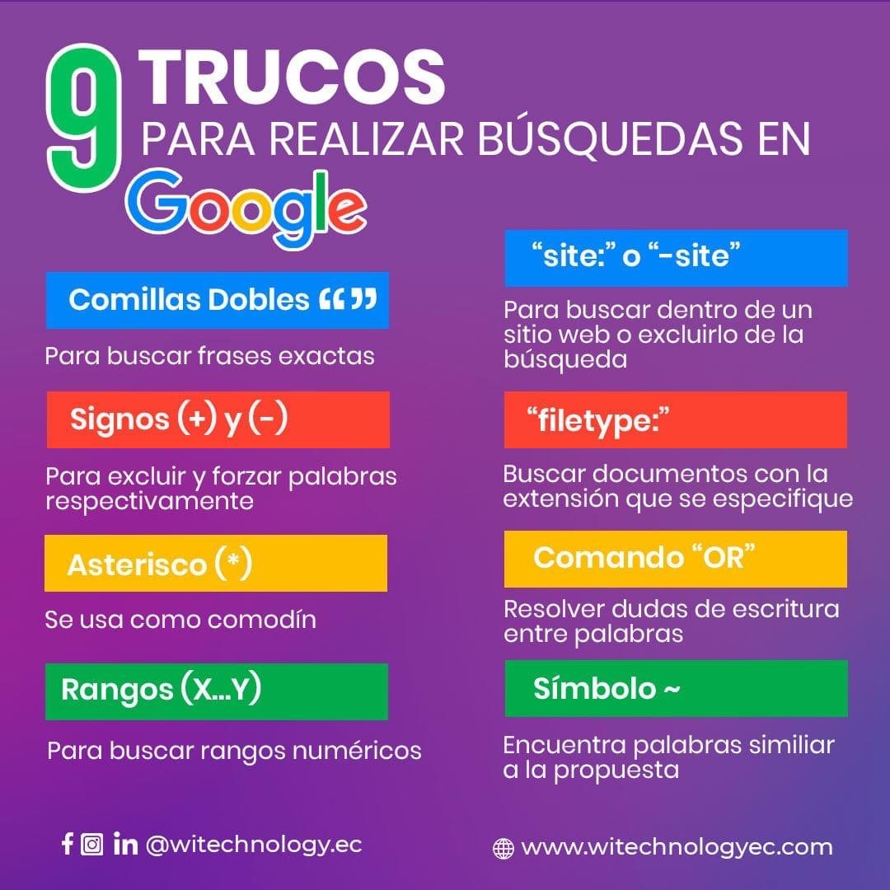

* **Lectura de Documentación Oficial**: todas las tecnologías tienen y cuentan con documentación oficial
  * Ejemplo: [HTML](https://developer.mozilla.org/es/docs/Web/HTML)
* **Traductores de navegador**
  * Ejemplo: Google Traductor
* Licencias y versionado
  * Licencias de software Shareware: corresponden a un tipo de distribución de aplicaciones que consiste en liberar gratuitamente una versión con funcionamiento limitado.
  * Licencias de software libre

## ¿Qué es la Web?

* En la metáfora que se propone, la World Wide Web serían las calles que unen a los distintos edificios o **servidores**. En ellos están almacenados todos los contenidos y servicios disponibles en Internet y los hacen disponibles para cualquier computadora. Es por ello que los servidores deben estar prendidos perpetuamente (tienen sistemas de seguridad ante problemas eléctricos u otros).

  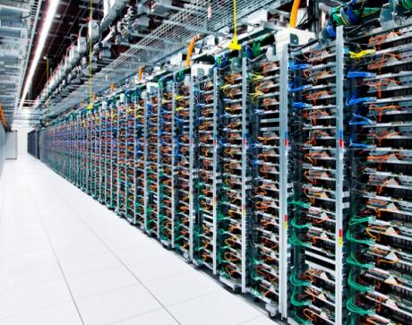

* Es un **conjunto de documentos** que se conectan a través de **hipervínculos**, junto con la web nace HTML, este lenguaje de marcado permite escribir documentos que puedan conectarse entre ellos.
* Utilizan el protocolo HTTP para conectar los servidores.
* Solicitan y muestran las páginas web almacenadas en los servidores.
* El 6 de agosto de 1991, Tim Berners-Lee, publicó el proyecto de la World Wide Web en el grupo de noticias alt.hypertext y con este suceso la Web comenzó a ser un servicio disponible públicamente en Internet.

  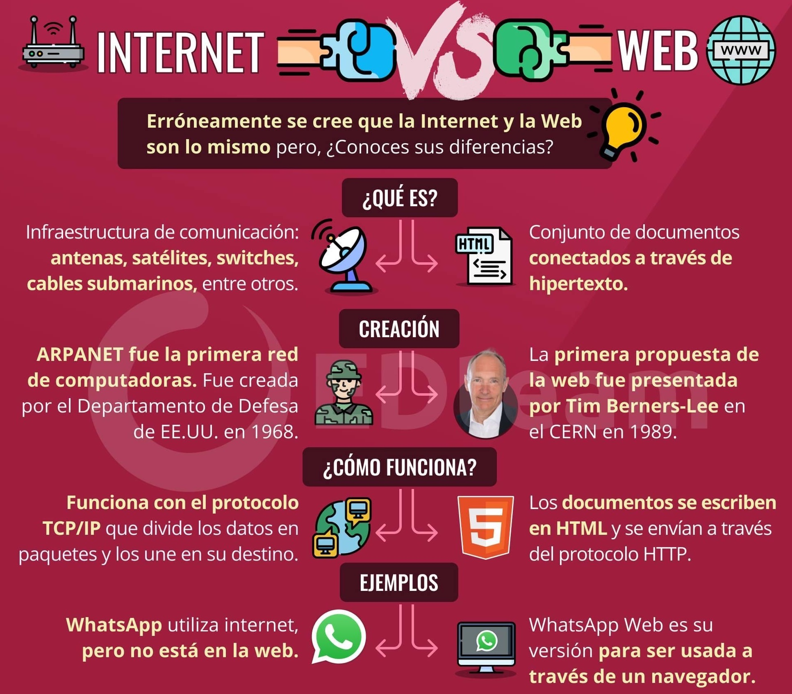

  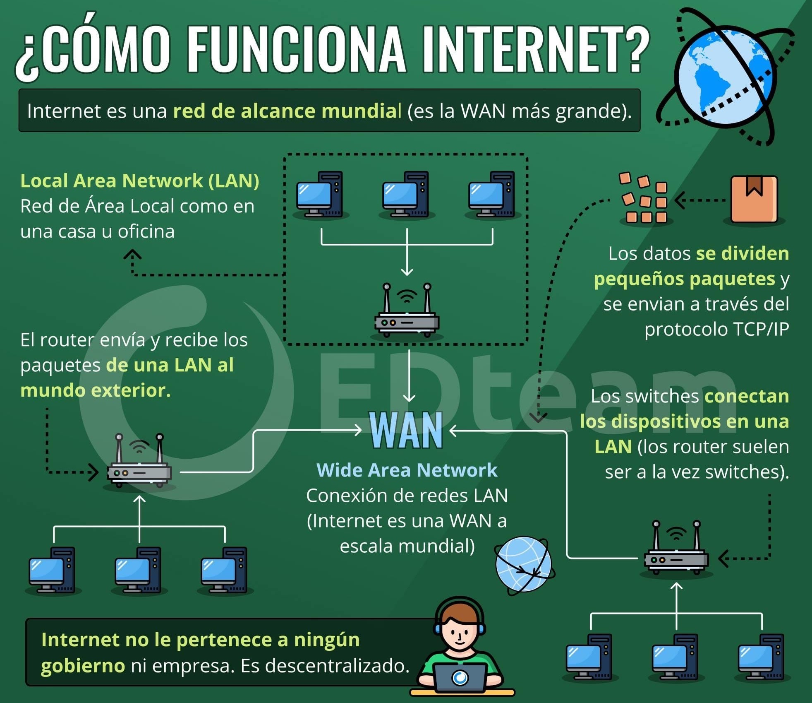

## Arquitectura Cliente Servidor

* Cada vez que navegas por Internet, usas la arquitectura cliente - servidor.

  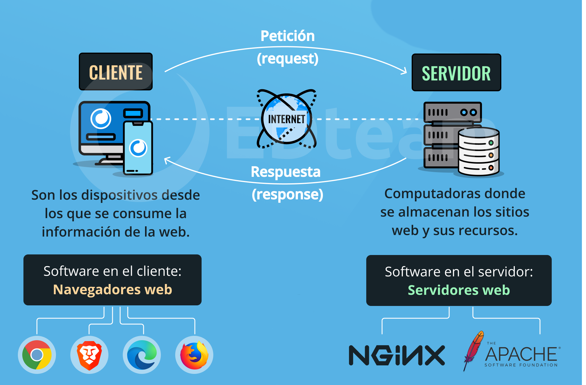

## Servidor Web

* Programa que se encuentra escuchando o esperando constantemente por una petición realizada desde la red (clientes).
* Almacenan y transmiten páginas web a los clientes.
* Cuando se recibe esta petición el servidor realiza la acción correspondiente, o responde de la manera adecuada y sigue escuchando.
* Un servidor web dialoga (o se comunica) con sus clientes a través del protocolo HTTP
* **Hosting**: es el espacio en un servidor donde se aloja un sitio web para que este pueda ser visible en Internet.

  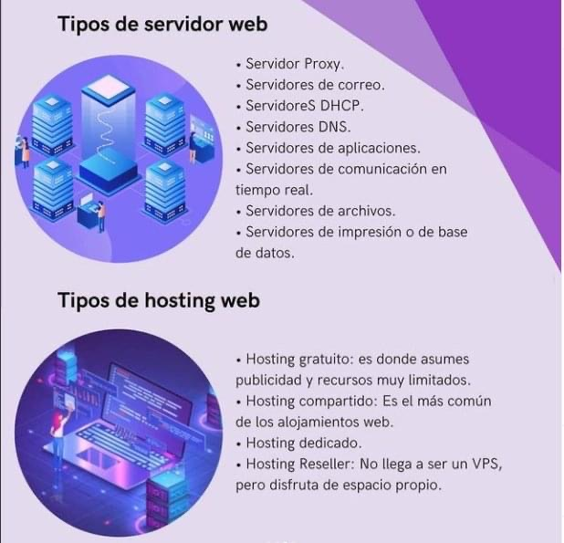

## HTTP

* HyperText Transfer Protocol (Protocolo de Transferencia de HiperTexto)
* Es el protocolo de transmisión de información de la World Wide Web, es decir, el código que se establece para que el computador solicitante y el que contiene la información solicitada puedan "hablar" un mismo idioma a la hora de transmitir información por la red
* Con el http se establecen criterios de sintaxis y semántica informática (forma y significado) para el establecimiento de la comunicación entre los diferentes elementos que constituyen la arquitectura web: servidores, clientes, proxies.
* Fue creado en 1999 por el World Wide Web Consortium en colaboración con la Internet Engineering Task Force.

## HTTPS

* HyperText Transfer Procotol Secure (Protocolo Seguro de Transferencia de Hipertexto)
* No es más que la versión segura del http, es decir, una variante del mismo protocolo que se basa en la creación de un canal cifrado para la transmisión de la información, lo cual lo hace más apropiado para ciertos datos de tipo sensible (como claves y usuarios personales).
* A diferencia del http, el https está protegido contra la intervención de terceros que puedan espiar el intercambio de información o hacerse con datos del mismo, mediante el uso de "capas de red" que permiten sólo al servidor y al cliente cifrar y descifrar la información enviada mediante el intercambio previo de certificados de red, una suerte de convalidación inicial de confianza para establecer la transferencia de información.

  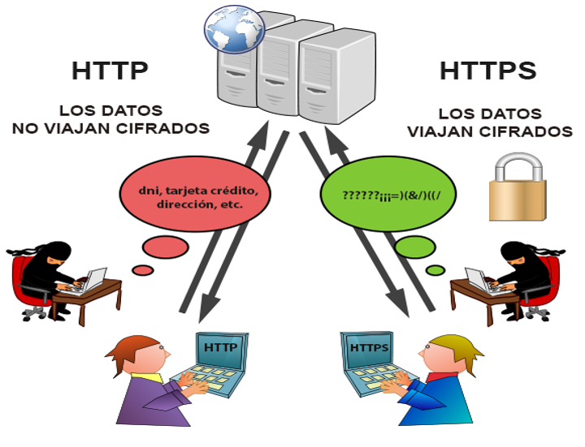

  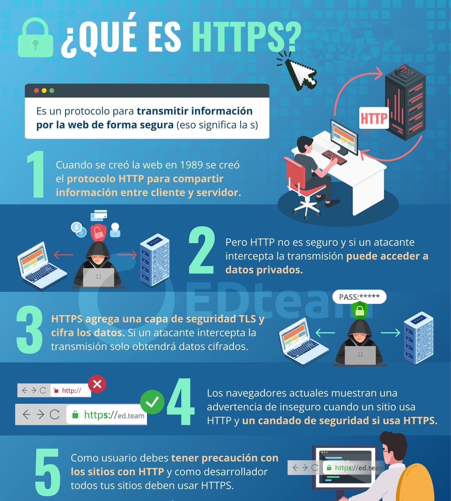

## URL

* Universal Resource Locator
* También llamado Dirección Web.
* Es el nombre por el que se encuentra a un sitio web.
* Se ocupa de enlazar recursos, que se mueven a través de direcciones IP o nombres de dominios.
* Es la dirección que se escribe en la barra de direcciones del navegador, sirve para acceder a un sitio web.
* Ejemplo: www.minegocio.com

  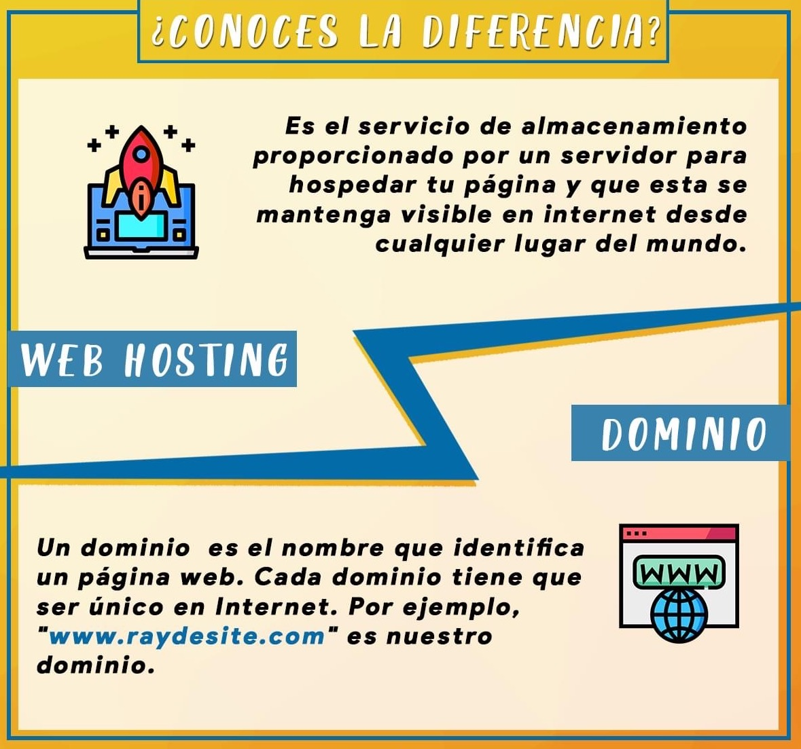

  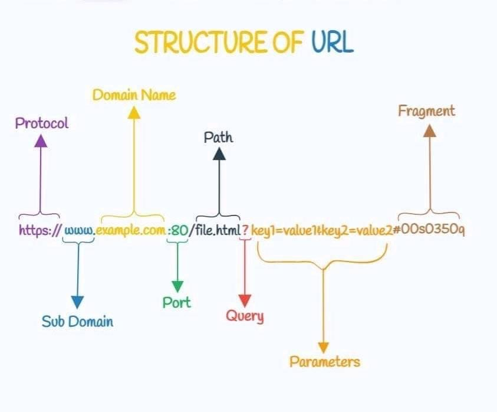

## Dirección IP (Internet Protocol)

* La dirección IP de una computadora es la identificación única que esa computadora tiene en Internet.
* Es uno de los "estándares" por el cual funciona la internet.
* Su fin es optimizar el envío de paquetes de datos.
* Para facilitar este envío, cada dispositivo conectado a internet recibe un número único.
* Las de mayor uso fueron las IPv4 formadas por cuatro números separados con puntos. Cada número representa un byte.
* Ejemplo: 172.54.221.6, 192.168.2.1

  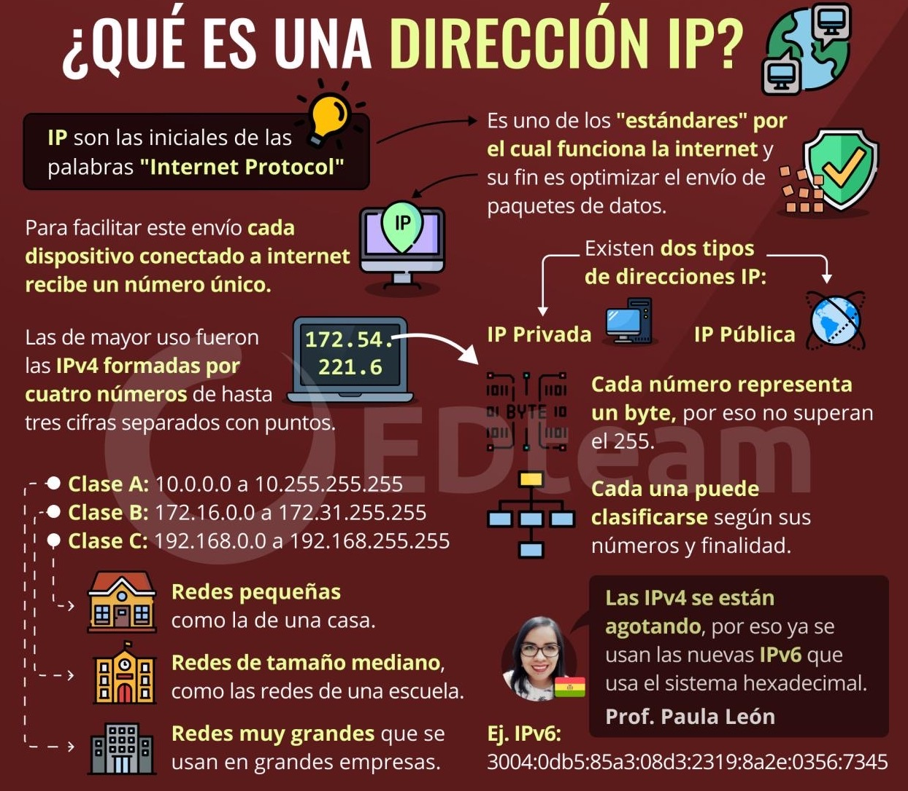

## Página vs Sitio vs Aplicación

* **Página Web**:
  * En esencia, las páginas web son documentos HTML (Hyper Text Markup Language) con distintos atributos estéticos CSS (Cascading Style Sheets) que han sido almacenados en un servidor por lo que se les puede acceder desde cualquier computadora usando un **navegador**.
  * Como veremos más adelante, los documentos HTML no son muy distintos de un documento word por ejemplo, sólo que tendrán una estructura más definida. A grandes rasgosm es esta:

    ```html
    <HTML>
      <HEAD>
        <TITLE>Título</TITLE>
      </HEAD>
      <BODY>
          Texto, gráficos, enlaces, etc.
      </BODY>
    </HTML>    
    ```
  
  * Los documentos HTML se pueden crear fácilmente desde cualquier computadora (como también lo veremos) pero para que se puedan almacenar en un servidor y puedan convertirse en páginas web se debe conseguir un dominio y un servicio de hosting.
  * Puede ser dinámica (con Base de Datos) o estática (sólo código)

    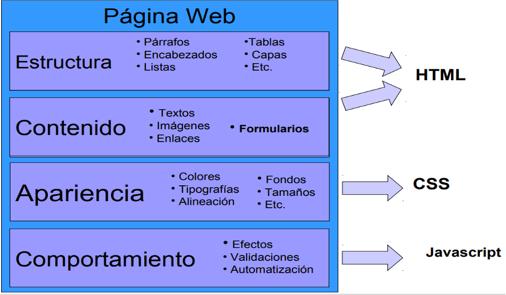

* **Sitio Web**:
  * Colección de páginas web vinculadas entre sí y estructuradas en un dominio; es decir, dotadas de una dirección web única.
  * Informa lo que hace una empresa (no es el negocio en si)
  * Pueden ser creadas por desarrolladores o personas que no sepan programar.

* **Aplicación Web**:
  * Software (programa informático) en la red (servidor) desarrollado con tecnologías web.
  * Es el núcleo del negocio de la empresa.
  * Se crea con código.
  * Son creadas por desarrolladores web profesionales.
  * El programa recibe los inputs del usuario.
  * El programa genera dinámicamente páginas web que muestran información personalizada y en su caso permiten al usuario seguir interactuando

## Página web: estática vs. dinámica

| Estática | Dinámica |
| -- | -- |
| La información está escrita directamente en el código | La información se lee desde una BD o una API |
| El contenido que ven los usuarios siempre es el mismo | La información de la página se adapta a cada uno de los usuarios |
| Cambiar la información implica modificar el código | Se puede editar el contenido a través de una interfaz |
| Su uso es común en sitios que cambian muy poco (publicidad, documentación) | Utilizada en sitios que cambian con frecuencia (ecommerce, redes sociales) |

## Desarrollo web


* Se divide en:
  * **Frontend**: es la parte encargada del lado del cliente (lo que se observa en pantalla)

    

  * **Backend**: es la parte encargada del lado del servidor (no es visible)

    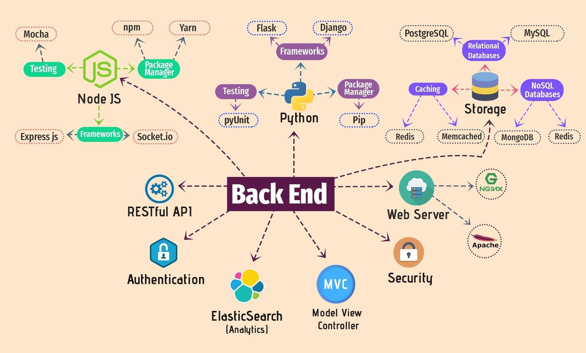

    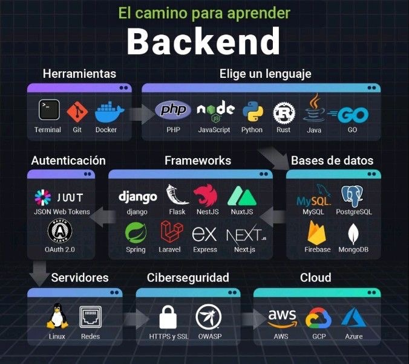

    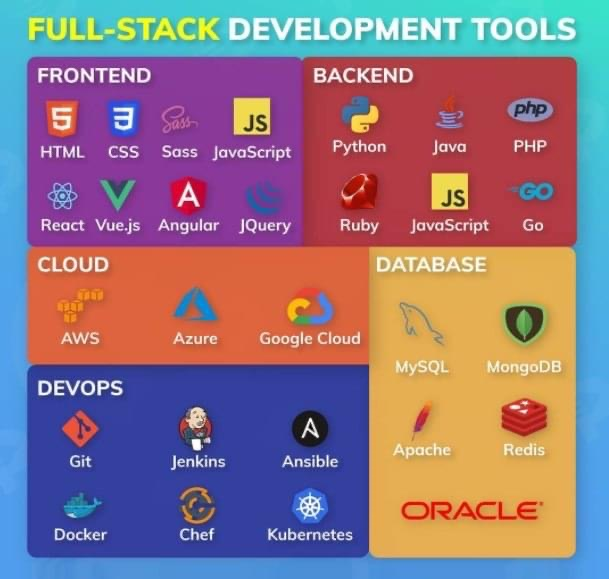

## API

* API: Application Programming Interface.
* Una interfaz es una capa que conecta dos sistemas.
* Una API es una interfaz que conecta aplicaciones para que compartan información.
* API Rest:
  * Rest es una arquitectura para APIs que se conectan vía web con el protocolo HTTP.
  * Permite acceder a la información con identificadores únicos (URI)

  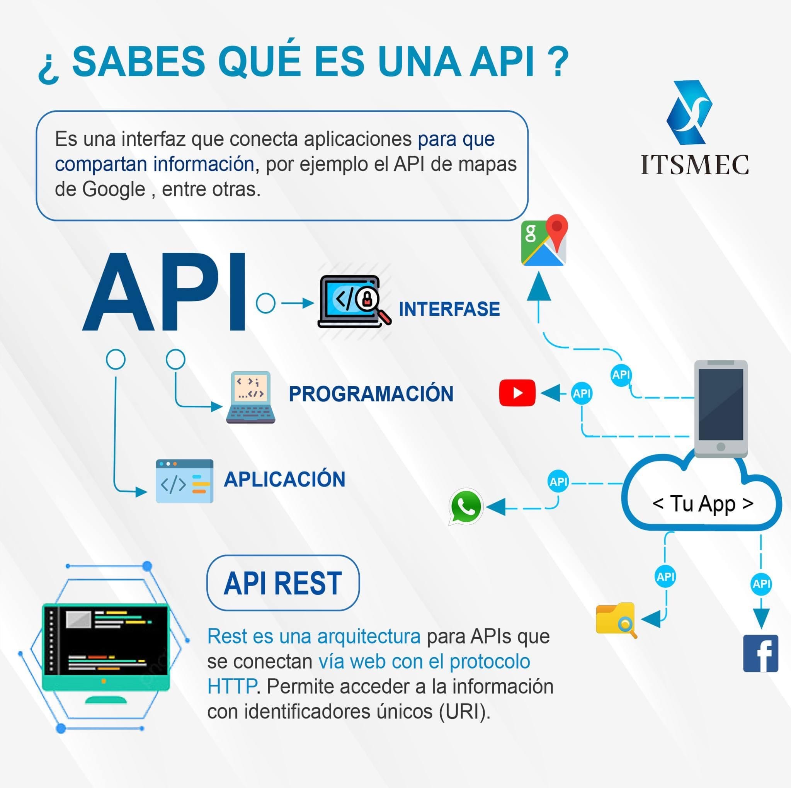

## Roles del Frontend

* **Diseñador UI**: diseña los flujos de usuario, las pantallas e interacciones en un programa de diseño (no escribe código)
* **Maquetador**: lleva el diseño a código HTML y CSS. No se preocupa de la lógica, sólo de la presentación.
* **Programador frontend**: agrega datos reales desde una API y lógica a la presentación creada por el maquetador.

```plain
Un desarrollador web frontend se encarga de producir código HTML, CSS y JS para el lado del cliente, entendible e interpretable por el navegador y que resulte en una experiencia web utilizable por el usuario
```

## Roles del Backend

* **Backend developer**: se encarga de la lógica del negocio (el código del lado del servidor) y crea las APIs para que el frontend pueda consumirlas.
* **Database administrator**: diseña, implementa, mejora y mantiene el sistema de base de datos.
* **Admonistrador del servidor**: gestiona la instalación, soporte y mantiene el servidor en donde se aloja la web o app.

## Navegador Web (Web Browser)

* Es un programa que permite visualizar en nuestra computadora la información que contiene una página web.
* Cada navegador web cuenta con un motor de renderizado.
* Renderizado es un proceso que ejecutan los motores de los navegadores web, que al cargar un sitio web, leen en tiempo real el código de los tags HTML, CSS y JavaScript, para poder transformarlos en los componentes visuales y textos formateados que conforman una web.
* Cada motor es particular, hay que lograr la compatibilidad necesaria para respetar al menos el desempeño de nuestras web en los navegadores más populares del momento. Recurso Web: www.caniuse.com
* Principales browsers:
  * Opera (1996)
  * Safari (2003)
  * Mozilla Firefox (2004)
  * Chrome (2008)
  * Brave (2016)
  * Edge Chromium (2020)

    

## Framework

* Conjunto de herramientas adaptables para ejecutar proyectos de forma ordenada y eficiente.
* Desarrolla proyectos completos o parte de un proyecto.
* Permite ahorrar tiempo y organizar mejor un proyecto.
* Existen frameworks para multimedia, aplicaciones web, tecnologías AJAX, gestión de contenidos, aplicaciones en general.
* Su uso no es paso obligatorio en el desarrollo de software, pero es muy usado dado el ahorro de tiempo que supone.
* Ejemplos: Vue, Django, Laravel, Angular, etc.

## Editor de código

* Es una herramienta especializada en desempeñar una tarea muy específica, editar archivos para escribir y modificar código.
* Ejemplos: Visual Studio Code, Sublime Text, CodePen, Atom, NotePad++, Brackets, etc.
  * [Descargar instalador de Visual Studio Code](https://code.visualstudio.com/download)
  * [Instalar y Configurar Sublime Text 3](https://youtu.be/rA7VucHRrRw)
  * [CodePen online](https://codepen.io/)

## Etapas básicas en el desarrollo de un proyecto web

1. **Planificación**: documenta los requerimientos del proyecto y las tecnologías a utilizar.
1. **UX/UI**: define los flujos e interacción del usuario y diseña la interfaz gráfica.
1. **Desarrollo**: desarrolla la UI, la BD y la lógica de la app.
1. **Despliegue**: verifica que el proyecto cumple con los requerimientos y se sube a producción.
1. **Soporte**: se corrigen errores no detectados en el desarrollo de la aplicación.

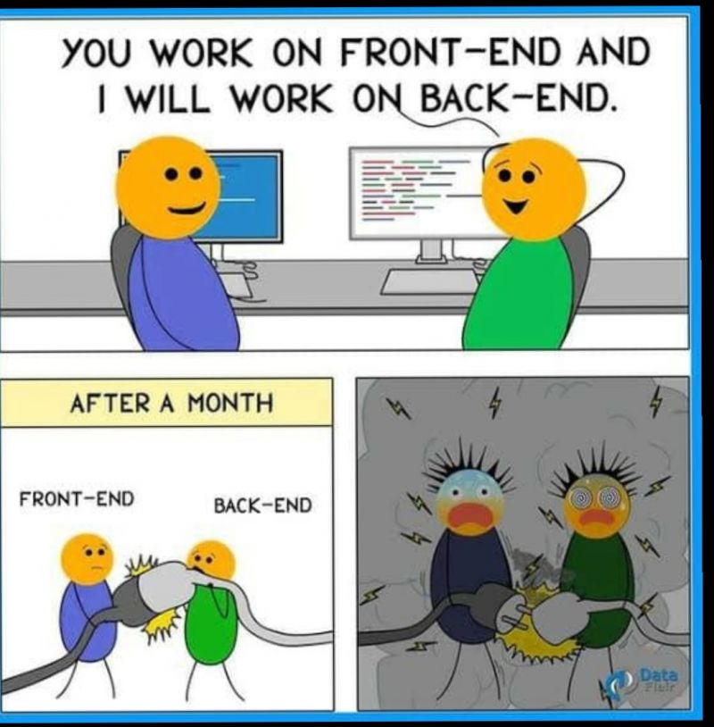

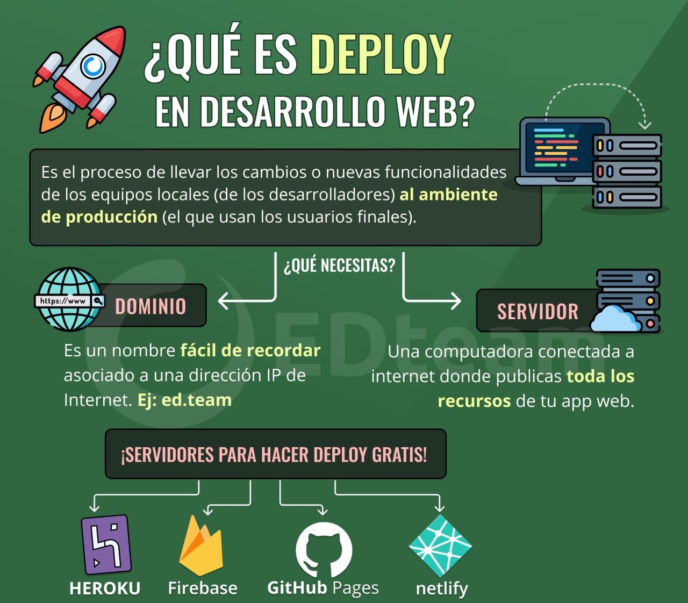

## La importancia del Testing

* Permite definir la fiabilidad y la robustez que la aplicación íntegra, y también los errores, conocidos como bugs, que esta tiene.
* La finalidad es pulir al máximo el control de errores, para entregar un producto lo más cercano a la perfección.
* La planificación de pruebas de usuario no debe ser un tema propio del área de QA, sino que debe estar encarada desde los inicios del diseño de toda aplicación (análisis funcional, desarrollo de software, testing).
* La usabilidad y la experiencia de usuario son factores clave en el momento de testear una aplicación.

## Automatización de tests

* Pone entre el tester y la aplicación de software un programa diseñado para controlar la ejecución de pruebas, y comparar de manera más rápida los resultados obtenidos y los resultados esperados.
* Generar reportes con las pruebas exitosas y fallidas.
* Guarda las métricas necesarias.
* Herramientas: Selenium, Cypress, HP Quicktest Professional, Rational Functional Tester, etc.

  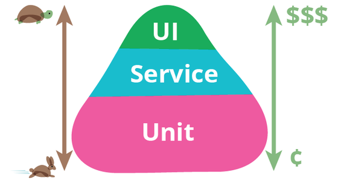

  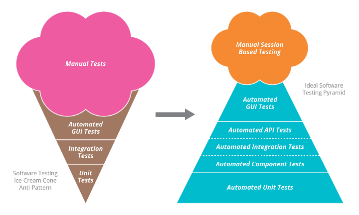

  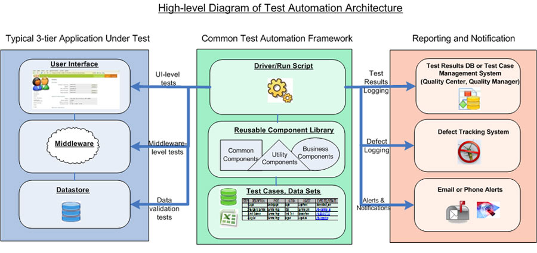

## Metodología de Trabajo

* Antiguo modelo de cascada: Diseño -> Desarrollo -> Testing
* Scrum:
  * Es un marco de trabajo ágil que orienta en el desarrollo de un proyecto en forma flexible y con adaptación rápida a los cambios.
  * Es un marco de trabajo a través del cual las personas pueden abordar problemas complejos adaptativos, a la vez que entregan productos de forma eficiente y creativa con el máximo valor.
  * Permite actividades en equipo a través de procesos de iteraciones.

  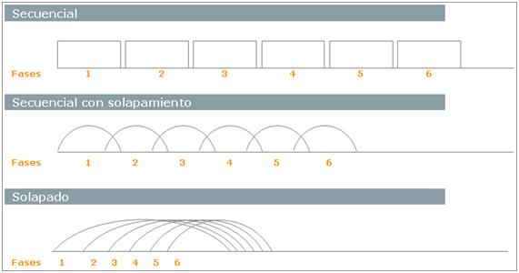
  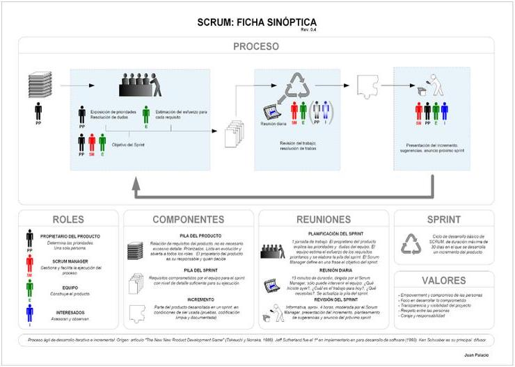
  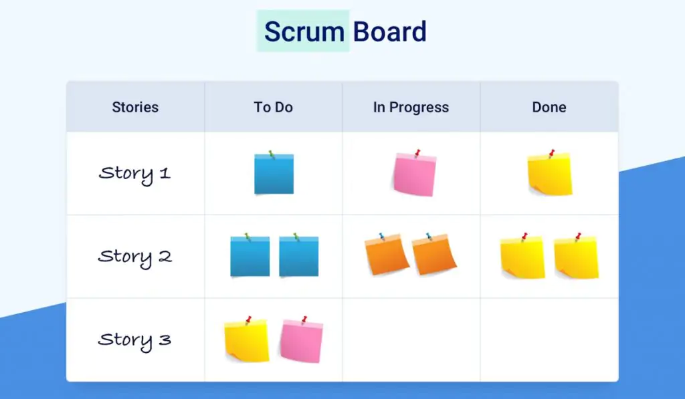

## Requisitos

* Historia de Usuario: App para un lavadero de autos
  * Como \<ROL> ej. **empleado**
  * Puedo \<ACCIONES> ej. **registrar**
  * Para \<JUSTIFICAR> ej. **cobrar**
* Comprobación -> criterios - se construye el software correcto
  * Dado el entorno donde se encuentra
  * Cuando hago algo
  * Entonces pasa algo

## Ejercicios

1. Actividad 1
    * Acceder a una página escribiendo la URL
    * Acceder a una página mediante un enlace contenido en otra. Ejemplo: "http://nombrededominio.com/contactame.html"
    * Ver el código fuente de una página.
    * Guardar una página web (sólo HTML) para luego ver el archivo guardado y visualizar la página.
    * Guardar una página web completa para luego ver los archivos guardados y visualizar la página.
