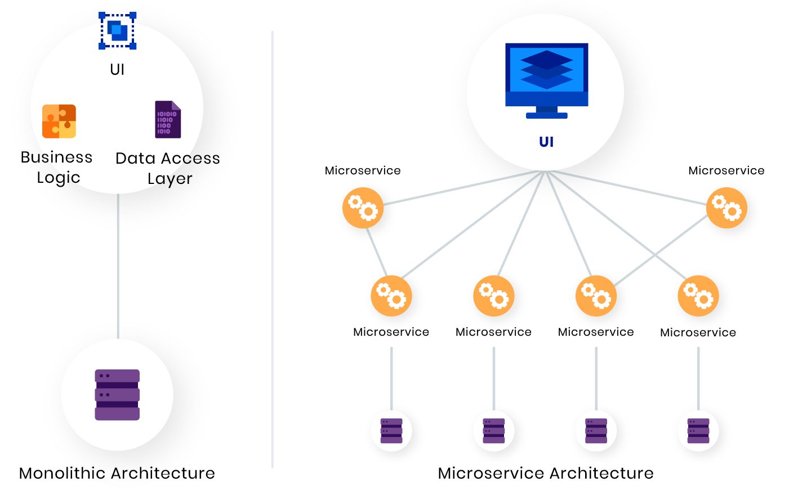

# Intro

## Web

* Es un conjunto de documentos **conectados a través de hipertexto**
* La **primera propuesta de la web fue presentada por Tim Berners-Lee** en el CERN en 1989
* Los **documentos se escriben en HTML** y se envian a través del **protocolo HTTP** (se utiliza para conectar los servidores)
* HTTP fue creado en 1999 por el W3C
* HTTP no es seguro y si un atacante intercepta la transmisión **puede acceder a datos privados**
* **HTTPS agrega una capa de seguridad TLS y cifra los datos**. Si un atacante intercepta la transmisión solo obtendrá datos cifrados

  

## Desarrollo Web

* Se divide en Frontend y Backend

  

* **Frontend**: es la parte encargada del **lado del cliente** (lo que se observa en pantalla)
  * Interfaces web (HTML5 - maquetado, CSS3 - estilos)
  * Lógica en el cliente (JS, JQuery)
  * Validaciones
  * Consumo de APIs (es una interfaz que conecta aplicaciones para que compartan información)
  * Frameworks: VUE, Angular, React

* **Backend**: es la parte encargada del **lado del servidor** (no es visible)
  * Lógica en el servidor:

    | Lenguaje | Frameworks | Testing | Package Manager |
    | -- | -- | -- | -- |
    | Java | Spring | JUnit | Gradle, Maven |
    | Node JS | Express, Next, Socket.io | Mocha | npm, Yarn |
    | Python  | Django, Flask | Pytest, pyUnit | pip |
    | PHP     | Laravel       | PHPUnit        | composer |
    | GO, Rust, Ruby, C# |    |                |     |

  * Programar API

    

  * Architectures: Monolith vs Microservices

   
  
  * Storage:
  
    | Tipos | SGBD |
    | -- | -- |
    | BD Relacionales | Oracle, PostgreSQL, MySQL |
    | BD noSQL        | MongoDB, Redis |
    | Caching         | Redis, Memcached |

  * Web Server (NGINX, Apache)
  * Rendimiento
  * Security/Authentication (JWT: JSON Web Tokens, OAuth 2.0)
  * Analytics (ElasticSearch)

  * **Other Tools**:

    |||
    | -- | -- |
    | CLI (terminal)| shell, Bash, zsh, tcsh |
    | VCS           | CVS, SVN, Perforce, ClearCase, Git, GitLab, GitHub |
    | Deploy        | Docker, Kubernetes, OpenShift |
    | CI/CD         | Jenkins |
    | Cloud         | AWS (Amazon Web Services), Google Cloud, Azure |
    | QA Automation | Selenium, Cypress |
    | A11Y          | pa11y, lighthouse |

## Backend developer

* Se encarga de la lógica del negocio (el código del lado del servidor)
* Crea las APIs para que el frontend pueda consumirlas

  

## Deploy

## Metodologías

* Waterfall (cascada): Design ->  Developmet -> Testing -> Maintenance
* Agile -> Scrum:
  * Es un framework ágil que orienta en el desarrollo de un proyecto en forma flexible y con adaptación rápida a los cambios
  * Es un framework a través del cual las personas pueden abordar problemas complejos adaptativos, a la vez que entregan productos de forma eficiente y creativa con el máximo valor
  * Permite actividades en equipo a través de procesos de iteraciones

    
    
    
