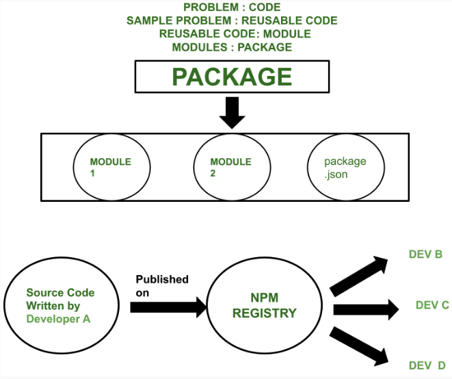
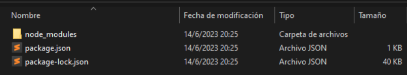
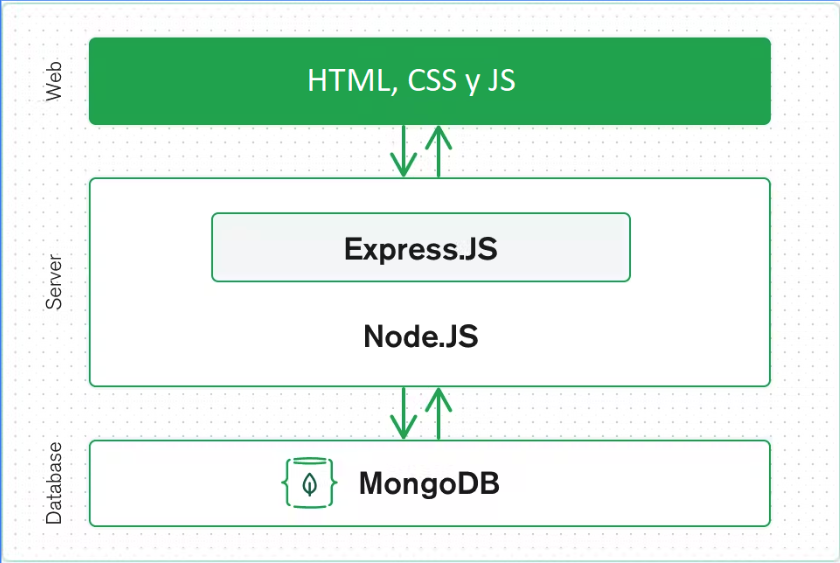

# Crear una aplicación Web con NodeJS y MongoDB

## Objetivo

* Obtener conocimientos generales para desarrollar una aplicación web, sobre todo haciendo foco en la interacción entre backend y frontend, en este caso utilizando Express como framework de servidor, MongoDB como base de datos y una página HTML simple como interfaz de usuario.

## NodeJS o Node

* Es un entorno de ejecución de JavaScript.
* Se utiliza para ejecutar código JavaScript fuera del navegador, muchas veces usado en el lado del servidor.

```js
//Archivo: ejemplo.js
var a = 5
var b = 10
var c = a + b
console.log('c = ' + c)
```

```shell
$node ejemplo
```

## Node y npm

* **Node**:
  * Cuenta con un sistema de módulos que permite a los desarrolladores organizar y reutilizar código de manera eficiente
  * Estos módulos pueden publicarse en NPM (Node Package Manager)

* **NPM**:
  * Uno de los registros de software más grande del mundo. 
  * Desarrolladores de código abierto de todo el mundo utilizan NPM para compartir y tomar prestados paquetes, también muchas organizaciones utilizan NPM para el desarrollo privado



## Proyectos NPM

* **Gestión de dependencias**: Instalar dependencias más fácil con el comando: npm install nombre_paquete.
* **Espacio en repositorios**: Menor espacio al subir y bajar proyectos en repositorios como gitlab, github, lo que implica también menor tiempo de subida y bajada, a veces las dependencias pueden pesar cientos de megas o gigas.
* **Scripts personalizados**: Puedes definir scripts personalizados en tu archivo package.json para ejecutar tareas específicas, como iniciar el servidor, ejecutar pruebas, construir el proyecto, etc.
* **Publicación y distribución de paquetes**: Si desarrollas tu propio paquete npm, tener un proyecto npm te permite publicarlo y distribuirlo fácilmente a otros desarrolladores.

## Express

* Es un framework de aplicaciones web rápido, minimalista y flexible para Node.js, que se distribuye como un paquete en NPM.
* Proporciona un conjunto de características y utilidades para facilitar el desarrollo de aplicaciones web, entre las que usaremos hoy son:
  * **Enrutamiento**: Express proporciona una API sencilla y expresiva para definir rutas y manejar las solicitudes HTTP entrantes.
  * **Integración con bases de datos**: Express se puede utilizar junto con diferentes bases de datos, incluyendo MongoDB, para realizar operaciones de persistencia de datos.

## Importar un proyecto npm

```shell
$npm init -y
$npm install express
```



## Hola mundo con Express

```js
//Archivo: index.js

//Importar el módulo de Express
const express = require('express')

//Crear una instancia de la aplicación Express
const app = express()

//Definir una ruta para la raíz del sitio
app.get('/', (req, res) => {
  res.send('Hola Mundo!')
})

//Escuchar en el puerto 3000
app.listen(3000, () => {
  console.log('Servidor iniciado en el puerto 3000')
})
```

```shell
$node index.js
```

* Abrir el navegador en localhost:3000

## Cliente y Servidor

* **Cliente**:
  * Es un software o dispositivo que inicia una solicitud de servicio o recursos a otro sistema, conocido como servidor.
  * Puede ser una aplicación web, un navegador, una aplicación móvil u otro software que requiere datos o servicios específicos.
  * En general, el cliente envía solicitudes al servidor y espera recibir respuestas con los datos o recursos solicitados.

* **Servidor**:
  * Es un software o dispositivo que proporciona servicios, recursos o información en respuesta a las solicitudes realizadas por los clientes.
  * Están diseñados para estar en constante escucha de las solicitudes de los clientes y responder de manera adecuada.
  * Pueden ser servidores web, servidores de bases de datos, servidores de correo electrónico, servidores de archivos, entre otros.


## HTTP

* Hypertext Transfer Protocol
* Protocolo de comunicación utilizado en la World Wide Web (WWW) para la transferencia de información entre un cliente y un servidor.
* Es el protocolo estándar utilizado para solicitar y enviar recursos, como páginas web, imágenes, videos, archivos, entre otros, a través de Internet.
* HTTP funciona siguiendo un modelo cliente-servidor, donde el cliente envía una solicitud (request) al servidor y espera una respuesta (response) en forma de un código de estado y los datos solicitados.

## Códigos de estado HTTP

* **Códigos de éxito (2xx)**:
  * **200 OK**: La solicitud se ha completado con éxito.
  * **201 Created**: La solicitud se ha completado y se ha creado un nuevo recurso.

* **Códigos de redirección (3xx)**:
  * **301 Moved Permanently**: El recurso solicitado se ha movido permanentemente a una nueva ubicación.
  * **302 Found**: El recurso solicitado se ha movido temporalmente a una nueva ubicación.
  * **304 Not Modified**: Indica que el recurso no ha sido modificado desde la última solicitud y puede ser utilizado en caché.

* **Códigos de error del cliente (4xx)**:
  * **400 Bad Request**: La solicitud no se puede entender o contiene sintaxis inválida.
  * **401 Unauthorized**: Se requiere autenticación para acceder al recurso.
  * **404 Not Found**: El recurso solicitado no se ha encontrado en el servidor.

* **Códigos de error del servidor (5xx)**:
  * **500 Internal Server Error**: El servidor ha encontrado una situación inesperada que le impide cumplir con la solicitud.
  * **502 Bad Gateway**: El servidor, como puerta de enlace, ha recibido una respuesta inválida del servidor ascendente.
  * **503 Service Unavailable**: El servidor no puede manejar la solicitud en este momento debido a una sobrecarga o mantenimiento temporal.

## Fetch

* Función integrada en JavaScript que se utiliza para realizar solicitudes de red (HTTP) y recuperar recursos de forma asíncrona.
* El uso de fetch también admite opciones adicionales para personalizar la solicitud, como el método HTTP utilizado (GET, POST, etc.), encabezados personalizados, envío de datos en el cuerpo de la solicitud, etc.

```js
fetch(url)
  .then(response => {
    // manipular la respuesta recibida
  })
  .catch(error => {
    // capturar y manejar cualquier error de red
  })
```

* Se comunica con el servidor de manera asíncrona, lo que significa que la solicitud se realiza en segundo plano y no bloquea la ejecución del resto del código JavaScript.
* **¿Qué pasaría si fuese sincrónica?**
  * Las funciones sincrónicas bloquean la ejecución del código hasta que se complete la operación
  * En el caso de las solicitudes HTTP al utilizarlo en una página web, esto significa que el código se detendría y esperaría la respuesta del servidor antes de continuar con el resto del flujo.
  * Durante ese tiempo de espera, la interfaz de usuario se bloquearía y el usuario no podría interactuar con la página web y podría afectar la experiencia del usuario de manera **negativa**.

## Base de datos

* Una base de datos es una colección organizada de datos estructurados que se almacenan de forma persistente en un sistema informático.
* Los datos se organizan en tablas o colecciones y se relacionan entre sí utilizando diferentes técnicas y estructuras de datos.
* Las bases de datos permiten almacenar, recuperar, modificar y eliminar datos de manera eficiente.
* También ofrecen funcionalidades para realizar consultas complejas, realizar análisis de datos, garantizar la integridad de los datos y aplicar reglas de seguridad y acceso.
* Existen diferentes tipos de bases de datos, incluyendo bases de datos relacionales (SQL), **bases de datos NoSQL**, bases de datos en memoria, bases de datos orientadas a objetos, entre otros. Cada tipo tiene sus propias características y se adapta a diferentes necesidades y requisitos de las aplicaciones.

### MongoDB

* Base de datos NoSQL
* Utiliza un enfoque basado en documentos, donde los datos se organizan en documentos flexibles similares a JSON.

### JSON

* JSON (JavaScript Object Notation)
* Es un formato ligero de intercambio de datos.
* Es ampliamente utilizado para representar y transmitir datos estructurados en aplicaciones web y sistemas informáticos.
* Está compuesto por una colección de pares de clave-valor, donde la clave es una cadena y el valor puede ser de cualquier tipo de dato válido en JSON, como un número, una cadena de texto, un booleano, un objeto JSON anidado o un arreglo de valores.
* { } para delimitar el JSON y los pares clave-valor separados por dos puntos (:)
* Ejemplo:

```json
{
  "nombre": "Juan",
  "edad": 30,
  "activo": true,
  "hobbies": ["futbol", "lectura", "viajes"],
  "direccion": {
    "calle": "Calle Principal",
    "numero": 123,
    "ciudad": "Ciudad Ejemplo"
  }
}
```

* Los JSON son fáciles de leer y escribir tanto para los humanos como para las máquinas. Son ampliamente utilizados en la comunicación entre aplicaciones cliente-servidor, ya que muchos lenguajes de programación tienen soporte nativo para convertir datos JSON en objetos y viceversa.

## Ejemplo


