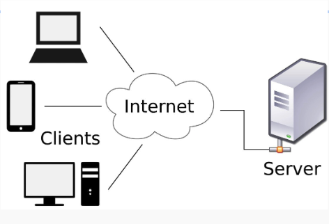

## Cliente y Servidor

* **Cliente**:
  * Es un software o dispositivo que inicia una solicitud de servicio o recursos a otro sistema, conocido como servidor.
  * Puede ser una aplicación web, un navegador, una aplicación móvil u otro software que requiere datos o servicios específicos.
  * En general, el cliente envía solicitudes al servidor y espera recibir respuestas con los datos o recursos solicitados.

* **Servidor**:
  * Es un software o dispositivo que proporciona servicios, recursos o información en respuesta a las solicitudes realizadas por los clientes.
  * Están diseñados para estar en constante escucha de las solicitudes de los clientes y responder de manera adecuada.
  * Pueden ser servidores web, servidores de bases de datos, servidores de correo electrónico, servidores de archivos, entre otros.

## HTTP

* Hypertext Transfer Protocol
* Protocolo de comunicación utilizado en la World Wide Web (WWW) para la transferencia de información entre un cliente y un servidor.
* Es el protocolo estándar utilizado para solicitar y enviar recursos, como páginas web, imágenes, videos, archivos, entre otros, a través de Internet.
* HTTP funciona siguiendo un modelo cliente-servidor, donde el cliente envía una solicitud (request) al servidor y espera una respuesta (response) en forma de un código de estado y los datos solicitados.

## Códigos de estado HTTP

* **Códigos de éxito (2xx)**:
  * **200 OK**: La solicitud se ha completado con éxito.
  * **201 Created**: La solicitud se ha completado y se ha creado un nuevo recurso.

* **Códigos de redirección (3xx)**:
  * **301 Moved Permanently**: El recurso solicitado se ha movido permanentemente a una nueva ubicación.
  * **302 Found**: El recurso solicitado se ha movido temporalmente a una nueva ubicación.
  * **304 Not Modified**: Indica que el recurso no ha sido modificado desde la última solicitud y puede ser utilizado en caché.

* **Códigos de error del cliente (4xx)**:
  * **400 Bad Request**: La solicitud no se puede entender o contiene sintaxis inválida.
  * **401 Unauthorized**: Se requiere autenticación para acceder al recurso.
  * **404 Not Found**: El recurso solicitado no se ha encontrado en el servidor.

* **Códigos de error del servidor (5xx)**:
  * **500 Internal Server Error**: El servidor ha encontrado una situación inesperada que le impide cumplir con la solicitud.
  * **502 Bad Gateway**: El servidor, como puerta de enlace, ha recibido una respuesta inválida del servidor ascendente.
  * **503 Service Unavailable**: El servidor no puede manejar la solicitud en este momento debido a una sobrecarga o mantenimiento temporal.
