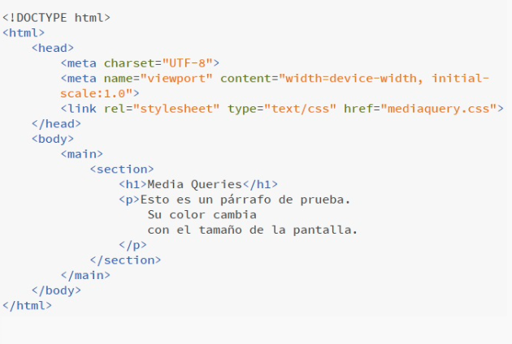
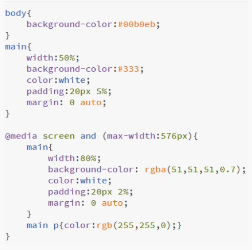
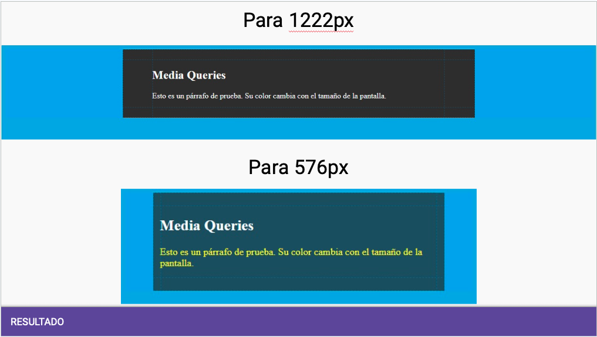

# Diseño Web Responsivo

* RWD: Responsive Web Design
* Es una filosofía/paradigma de diseño y desarrollo cuyo objetivo es adaptar la apariencia de las páginas web al dispositivo que se esté utilizando para visitarlas (tablets, smartphones, ebook, notebooks, PCs, etc.)
* Dentro de cada tipo, cada dispositivo tiene sus características concretas: tamaño de pantalla, resolución, potencia de CPU, etc.
* Esta tecnología pretende que con un único diseño web, todo se vea correctamente en cualquier dispositivo.

## Media queries

* En esencia es un condicional de CSS.
* Permite resolver diferentes estilos de reglas CSS según el tipo de pantalla que carga el documento HTML.
* Los ajustes estéticos son establecidos condicionalmente a través de la regla @media.
* De esta manera, la página se mostrará con características, estilos y visualización de elementos, de acuerdo al dispositivo que la invocó.

```html
<link rel="stylesheet" type="text/css" href="" media="screen" />
```

* Sintaxis básica: se establece el tipo de medio y las condiciones que se quiere que cumplan y, de ser cierto, se implementa cierto código.

```css
@media mediatype and (not | only mediatype and | not | only media-feature) {
  código css
}
```

## Ejemplo 1

```css
@media screen and (min-width: 480px) {
  body {
    background: gray;
  }
}

@media screen and (min-width: 720px) {
  body {
    background: red;
  }
}
```

## Ejemplo 2

* **HTML**: Tomemos el siguiente código HTML, en el cual se presenta un título y un párrafo dentro de una sección en el main del documento. Notar que este documento tiene un archivo CSS vinculado, y tiene declarado el viewport.



* **CSS**: Tomemos ahora el código CSS y apliquemoslo al html. Notar que cuando la pantalla sea menor a 576px, se aplican ciertas propiedades y para todo lo demás, ciertas otras.



* **Resultado**:


